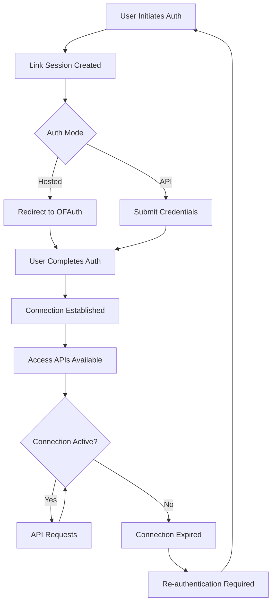

## Authentication Methods

### API Key Authentication

All API requests require authentication using your API key:

```http
apikey: YOUR_API_KEY
```

<Warning>
	**Security**: Keep your API keys secure. Never expose them in client-side
	code, commit them to version control, or share them publicly.
</Warning>

### Connection-Based Access

For accessing OnlyFans data, you have two authentication options:

**Option 1: Link Connection ID (Recommended)**

```http
apikey: YOUR_API_KEY
x-connection-id: conn_abc123def456
```

**Option 2: Direct Session Headers**

```http
apikey: YOUR_API_KEY
x-of-cookie: ONLYFANS_SESSION_COOKIE
x-of-user-agent: ONLYFANS_USER_AGENT
x-of-bc: ONLYFANS_X_BC (optional)
x-of-user-id: ONLYFANS_USER_ID (optional)
```

Connection IDs are obtained through the Link API authentication flow and represent an authenticated user's OnlyFans account with automatic session management. Alternatively, you can provide OnlyFans session headers directly if you handle authentication separately. When doing so, ensure the cookie contains `fp`, `auth_id`, and `sess` values unless you override them with `x-of-bc` and `x-of-user-id`.

## Connection Management

### Connection Lifecycle



### Connection States

- **Pending**: Authentication in progress
- **Active**: Ready for API access
- **Expired**: Session ended, re-authentication needed
- **Failed**: Authentication failed, retry

### Connection Persistence

Connections are designed to be long-lived but may expire due to:

- OnlyFans session expiration
- User password changes
- User account deactivation
- Extended inactivity
- Security-related revocation

## Dynamic Rules for Request Signing

### Purpose

OnlyFans requires cryptographically signed requests for API access, and their signing requirements change **very frequently** (sometimes multiple times per day). The Dynamic Rules system provides the current signing parameters needed to generate valid signatures that OnlyFans will accept.

<Info>
	**Access API Users**: If you're using OFAuth's [Access
	API](/api-reference/access/overview) to make OnlyFans requests, **request
	signing is handled automatically**. You only need dynamic rules if you're
	making direct requests to OnlyFans APIs outside of OFAuth's Access API.
</Info>

<Warning>
	**Critical for Direct API Access**: Without current dynamic rules, direct
	OnlyFans API requests will fail with authentication errors. The signing
	requirements change so frequently that hardcoded values become obsolete within
	hours.
</Warning>

### How It Works

1. **Real-time Updates**: OFAuth monitors OnlyFans signing requirement changes 24/7
2. **Rule Distribution**: Updated signing parameters are available immediately via API
3. **Signature Generation**: Use current rules to generate valid request signatures
4. **Automatic Validation**: OFAuth ensures signatures match OnlyFans' current expectations

Without current rules, your requests will receive 401/403 errors from OnlyFans, regardless of having valid user credentials.

## Security Architecture

### Data Protection

- **Encryption**: AES-256 encryption for stored data
- **TLS 1.3**: All communications encrypted in transit
- **Key Rotation**: Regular encryption key rotation
- **Zero-Knowledge**: OFAuth never stores OnlyFans passwords

### Access Control

- **API Key Scoping**: Keys limited to specific permissions
- **Connection Isolation**: Users can only access their own data
- **Audit Logging**: All API access logged and monitored
- **Rate Limiting**: Protection against abuse

### Compliance

- **GDPR**: Full compliance with EU data protection regulations
- **SOC 2**: Type II compliance for security controls
- **OWASP**: Security practices aligned with OWASP guidelines
- **Penetration Testing**: Regular third-party security assessments

## Best Practices

<CardGroup cols={2}>
	<Card title="API Key Security" icon="key">
		- Store in environment variables - Never commit to version control - Rotate
		regularly - Use server-side only
	</Card>
	<Card title="Connection Management" icon="link">
		- Monitor connection status - Handle expiration gracefully - Implement
		re-authentication flows - Store connection IDs securely
	</Card>
	<Card title="Session Security" icon="shield">
		- Use HTTPS only - Validate all inputs - Implement proper error handling -
		Monitor for suspicious activity
	</Card>
	<Card title="Compliance" icon="check-circle">
		- Follow data protection laws - Implement audit trails - Regular security
		reviews - User consent management
	</Card>
</CardGroup>

## Next Steps

<CardGroup cols={3}>
	<Card
		title="Rate Limiting"
		icon="gauge"
		href="/architecture/rate-limiting">
		Learn about token bucket rate limiting
	</Card>
	<Card
		title="Error Handling"
		icon="exclamation-triangle"
		href="/architecture/error-handling">
		Understand error codes and debugging
	</Card>
	<Card title="Quick Start" icon="rocket" href="/getting-started/quickstart/authentication">
		Implement authentication flow
	</Card>
</CardGroup>
