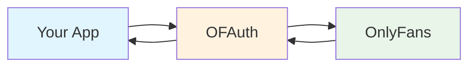
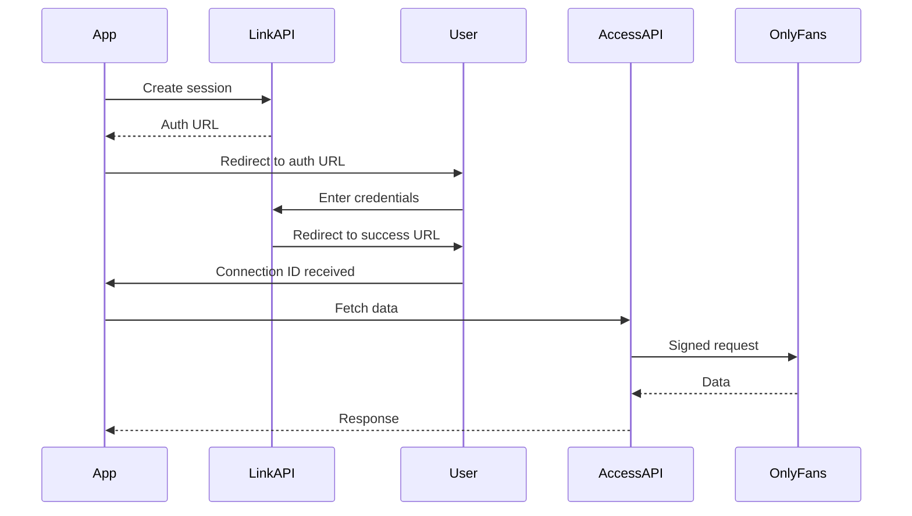

## The Big Picture

OFAuth is like **Plaid for OnlyFans**. Just as Plaid lets apps connect to bank accounts without handling sensitive banking credentials, OFAuth lets your app connect to OnlyFans accounts without managing authentication complexity.



**You focus on your product. OFAuth handles OnlyFans.**

---

## Key Concepts

### Connection

A **Connection** represents a linked OnlyFans account. When a user authenticates through OFAuth, you receive a Connection ID that you can use to access their data.

<CardGroup cols={2}>
	<Card title="What You Store" icon="database">
		Just the Connection ID (e.g., `conn_abc123`) - a simple string you save in your database
	</Card>
	<Card title="What OFAuth Handles" icon="shield-check">
		Sessions, credentials, expiration, re-authentication - all the complexity
	</Card>
</CardGroup>

**Think of a Connection ID like an access token** - it represents permission to act on behalf of a user.

---

### Link API

The **Link API** handles user authentication. It's how OnlyFans users connect their accounts to your app.

<Steps>
	<Step title="You create a Link session">
		Your backend calls OFAuth to get an authentication URL
	</Step>
	<Step title="User authenticates">
		They log into OnlyFans on a secure OFAuth-hosted page
	</Step>
	<Step title="You receive a Connection">
		OFAuth redirects back with a Connection ID you can use
	</Step>
</Steps>

**Link is similar to OAuth** - users see a branded consent flow, enter their credentials on a trusted page, and your app receives a token (the Connection ID) to use.

<Info>
	You never see or handle OnlyFans passwords. The authentication happens entirely on OFAuth's secure pages.
</Info>

---

### Access API

The **Access API** lets you fetch OnlyFans data using a Connection ID. It's a proxy that handles request signing, session management, and API complexity.

```
Your App → Access API → OnlyFans → Access API → Your App
              ↑
     Handles signing, retries,
     rate limits, and errors
```

**Two ways to use it:**

| Method | Best For |
|--------|----------|
| **Managed Endpoints** | Common operations like fetching profiles, posts, messages - stable, typed responses |
| **Proxy Endpoints** | Any OnlyFans API path - raw responses for advanced use cases |

<Tip>
	Most integrations only use Managed Endpoints. The Proxy is there when you need something specific that isn't covered.
</Tip>

---

### Dynamic Rules (Advanced)

OnlyFans requires cryptographically signed requests. These signing rules **change frequently** - sometimes multiple times per day.

<Warning>
	**Most users don't need Dynamic Rules.** If you're using the Access API or SDK, signing is automatic. Dynamic Rules are only for advanced use cases where you call OnlyFans APIs directly.
</Warning>

| If you're using... | Do you need Dynamic Rules? |
|-------------------|---------------------------|
| Access API | No - signing is automatic |
| JavaScript SDK | No - handled by the SDK |
| Direct OnlyFans calls | Yes - you need current signing rules |

---

## How the Pieces Fit Together

Here's the typical flow for an OFAuth integration:



1. **Link** creates the connection (one-time per user)
2. **Access** fetches data using that connection (ongoing)

---

## Common Questions

<AccordionGroup>

<Accordion title="What happens when a session expires?">
OnlyFans sessions can expire for various reasons. When they do:

- OFAuth can notify you via webhooks
- Access API calls return a specific error code
- Users need to re-authenticate through Link

You're only billed for active connections. Expired ones don't count toward your usage.
</Accordion>

<Accordion title="Can I use OFAuth with any programming language?">
Yes! OFAuth provides REST APIs that work with any language. We also offer:

- **TypeScript SDK** - Full-featured SDK with type safety
- **REST APIs** - Use from Python, Go, PHP, Ruby, or anything that makes HTTP requests

Check [Choose Your Path](/getting-started/choose-your-path) to pick the best approach for your stack.
</Accordion>

<Accordion title="Is my users' data stored by OFAuth?">
OFAuth proxies requests to OnlyFans and returns responses directly. We don't store OnlyFans content data. We do maintain:

- Connection metadata (status, timestamps)
- Session information (encrypted)
- Usage metrics for billing
</Accordion>

<Accordion title="What if OnlyFans changes their API?">
This is exactly why OFAuth exists. OnlyFans frequently changes their API without notice. OFAuth:

- Monitors changes 24/7
- Updates signing rules automatically
- Provides stable SDK/API interfaces
- Notifies you of breaking changes via webhooks

See [Production Considerations](/getting-started/production-considerations) for more on handling changes.
</Accordion>

</AccordionGroup>

---

## Glossary

| Term | Definition |
|------|------------|
| **Connection** | A linked OnlyFans account, represented by a Connection ID |
| **Connection ID** | Unique identifier (e.g., `conn_abc123`) used to access a user's data |
| **Link Session** | Temporary authentication flow - expires after 1 hour |
| **Client Secret** | Token identifying a Link session (e.g., `cs_xyz789`) |
| **API Key** | Your OFAuth API key for authenticating requests |
| **Dynamic Rules** | Current OnlyFans request signing parameters |

---

## Next Steps

<CardGroup cols={2}>
	<Card title="Quick Start" icon="rocket" href="/getting-started/quickstart/index">
		Jump into a hands-on tutorial (10 minutes)
	</Card>
	<Card title="Choose Your Path" icon="route" href="/getting-started/choose-your-path">
		Pick the right integration approach for your stack
	</Card>
</CardGroup>

