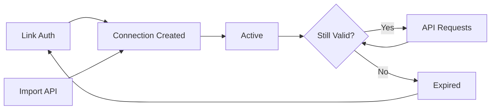

Connections represent authenticated OnlyFans accounts linked to your organization. There are two ways to create connections:

- **Link authentication** — Users authenticate through OFAuth's secure [Link](/guides/link) flow. OFAuth handles credentials, 2FA, and session management.
- **Import** — You provide existing OnlyFans session data directly via the API. Useful if you manage authentication yourself or are migrating from another system.

Both types produce a Connection ID that you use with the [Access API](/api-reference/access/overview) to interact with OnlyFans data.

## Creating Connections via Link

### Obtaining Connection IDs

After a user completes authentication through Link, you receive the connection ID through one of these methods:

| Method | When to Use |
|--------|-------------|
| [`connection.created` webhook](/reference/webhooks) | **Recommended.** Server-side, reliable, includes full details |
| [Embed `onSuccess` callback](/guides/link#success-metadata) | Client-side, immediate feedback for embedded flows |
| [Redirect query params](/guides/link#callback-parameters) | Hosted redirect flow, `connection_id` in URL |

### Using Client Reference ID

The `clientReferenceId` you provide when [initializing a Link session](/api-reference/link/init) is your key to mapping connections to users in your system:

```javascript
// 1. When initializing Link, pass your internal user ID
const session = await fetch("https://api.ofauth.com/v2/link/init", {
  method: "POST",
  headers: { apikey: "YOUR_API_KEY", "Content-Type": "application/json" },
  body: JSON.stringify({
    redirectUrl: "https://yourapp.com/callback",
    clientReferenceId: "user_abc123" // Your internal user ID
  })
});
```

```javascript
// 2. In webhook handler, use clientReferenceId to store the connection
app.post("/webhooks/ofauth", async (req, res) => {
  const { type, data } = req.body;
  
  if (type === "connection.created") {
    // Use clientReferenceId to find your user and store their connection
    await db.users.update({
      where: { id: data.clientReferenceId },
      data: { connectionId: data.connection.id }
    });
  }
  
  res.status(200).send("ok");
});
```

<Tip>
Always pass a `clientReferenceId` when initializing Link sessions. This is the recommended way to correlate connections back to your users, especially when using webhooks.
</Tip>

## Importing Connections

If you manage OnlyFans authentication yourself, you can import sessions directly. Imported connections are **not billed monthly** and are **not health-checked** by the connection monitor. They can be used through the Access API immediately.

### Import a Connection

```http
POST /v2/account/connections/import
```

| Field | Type | Required | Description |
|-------|------|----------|-------------|
| `cookie` | string | Yes | OnlyFans session cookie. Must contain `auth_id`, `sess`, and `fp` values. |
| `userAgent` | string | Yes | The user agent string used to create the session. |
| `permissions` | string[] | No | Permissions to grant. Defaults to organization permissions. |
| `clientReferenceId` | string | No | Your internal reference ID for tracking. |

OFAuth validates the session by making a request to OnlyFans and automatically fetches the user's profile data. If the session is invalid or expired, the import will fail.

<CodeGroup>

```bash cURL
curl -X POST https://api.ofauth.com/v2/account/connections/import \
  -H "apikey: YOUR_API_KEY" \
  -H "Content-Type: application/json" \
  -d '{
    "cookie": "auth_id=123456; sess=your_session_token; fp=your_fingerprint",
    "userAgent": "Mozilla/5.0 (Macintosh; Intel Mac OS X 10_15_7) AppleWebKit/537.36 ...",
    "clientReferenceId": "user_abc123"
  }'
```

```javascript Node.js
const response = await fetch("https://api.ofauth.com/v2/account/connections/import", {
  method: "POST",
  headers: {
    apikey: "YOUR_API_KEY",
    "Content-Type": "application/json"
  },
  body: JSON.stringify({
    cookie: "auth_id=123456; sess=your_session_token; fp=your_fingerprint",
    userAgent: "Mozilla/5.0 (Macintosh; Intel Mac OS X 10_15_7) AppleWebKit/537.36 ...",
    clientReferenceId: "user_abc123"
  })
})

const connection = await response.json()
console.log("Imported:", connection.id, connection.userData.username)
```

```python Python
import requests

response = requests.post(
    "https://api.ofauth.com/v2/account/connections/import",
    headers={
        "apikey": "YOUR_API_KEY",
        "Content-Type": "application/json"
    },
    json={
        "cookie": "auth_id=123456; sess=your_session_token; fp=your_fingerprint",
        "userAgent": "Mozilla/5.0 (Macintosh; Intel Mac OS X 10_15_7) AppleWebKit/537.36 ...",
        "clientReferenceId": "user_abc123"
    }
)

connection = response.json()
print("Imported:", connection["id"], connection["userData"]["username"])
```

</CodeGroup>

The response includes the full connection object with `imported: true` and the user's profile data fetched from OnlyFans.

<Warning>
If an active connection with the same OnlyFans user already exists, the import returns a `409` error with the existing connection ID. You can update the session on the existing connection using the [update endpoint](#updating-an-imported-session) instead.
</Warning>

### Updating an Imported Session

If an imported connection's session expires or needs to be rotated, you can update it in place without deleting and re-importing. This preserves the connection ID.

```http
PATCH /v2/account/connections/import/{connectionId}
```

| Field | Type | Required | Description |
|-------|------|----------|-------------|
| `cookie` | string | Yes | New OnlyFans session cookie. Must contain `auth_id`, `sess`, and `fp` values. |
| `userAgent` | string | Yes | The user agent string used to create the new session. |

The new session is validated against OnlyFans and **must belong to the same OnlyFans user** as the existing connection. If the user ID from the new cookie doesn't match, the request returns a `409` error.

<CodeGroup>

```bash cURL
curl -X PATCH https://api.ofauth.com/v2/account/connections/import/conn_abc123xyz \
  -H "apikey: YOUR_API_KEY" \
  -H "Content-Type: application/json" \
  -d '{
    "cookie": "auth_id=123456; sess=new_session_token; fp=new_fingerprint",
    "userAgent": "Mozilla/5.0 (Macintosh; Intel Mac OS X 10_15_7) AppleWebKit/537.36 ..."
  }'
```

```javascript Node.js
const response = await fetch("https://api.ofauth.com/v2/account/connections/import/conn_abc123xyz", {
  method: "PATCH",
  headers: {
    apikey: "YOUR_API_KEY",
    "Content-Type": "application/json"
  },
  body: JSON.stringify({
    cookie: "auth_id=123456; sess=new_session_token; fp=new_fingerprint",
    userAgent: "Mozilla/5.0 (Macintosh; Intel Mac OS X 10_15_7) AppleWebKit/537.36 ..."
  })
})

const connection = await response.json()
console.log("Updated:", connection.id, connection.status)
```

```python Python
import requests

response = requests.patch(
    "https://api.ofauth.com/v2/account/connections/import/conn_abc123xyz",
    headers={
        "apikey": "YOUR_API_KEY",
        "Content-Type": "application/json"
    },
    json={
        "cookie": "auth_id=123456; sess=new_session_token; fp=new_fingerprint",
        "userAgent": "Mozilla/5.0 (Macintosh; Intel Mac OS X 10_15_7) AppleWebKit/537.36 ..."
    }
)

connection = response.json()
print("Updated:", connection["id"], connection["status"])
```

</CodeGroup>

On success, the connection status is set back to `active` and the response includes updated user profile data from OnlyFans.

<Info>
This endpoint only works for imported connections (`imported: true`). Link-managed connections cannot be updated through this endpoint.
</Info>

### Filtering by Type

List only imported or Link-created connections:

```http
GET /v2/connections?imported=true
GET /v2/connections?imported=false
```

---

## Connection States

| State | Description |
|-------|-------------|
| `active` | Ready for API access |
| `awaiting_2fa` | Waiting for 2FA verification |
| `expired` | Session ended, re-authentication needed |

## Connection Lifecycle



Connections may expire due to:
- OnlyFans session expiration
- User password changes
- Extended inactivity

<Tip>
Set up [webhooks](/reference/webhooks) to receive `connection.expired` events.
</Tip>

## API Reference

### List Connections

```http
GET /v2/connections
```

| Parameter | Type | Description |
|-----------|------|-------------|
| `limit` | integer | Max results (default: 10) |
| `offset` | integer | Skip count (default: 0) |
| `status` | string | Filter: `active`, `expired`, `awaiting_2fa` |
| `imported` | string | Filter: `true` (imported only), `false` (Link-created only) |

### Delete Connection

```http
DELETE /v2/connections/{connectionId}
```

<Warning>
Deleting a connection logs the user out and stops billing. The connection record is permanently removed.
</Warning>

### Invalidate Connection

```http
POST /v2/connections/{connectionId}/invalidate
```

Invalidates a connection by marking it as expired and logging out the user. Unlike deletion, the connection record is preserved, making it ideal for:

- **Updating permissions**: When your platform's required permissions change, invalidate the connection so users reconnect with the new permission set
- **Security rotation**: Force users to re-authenticate without losing their connection history
- **Graceful session refresh**: Refresh credentials while maintaining connection metadata

<Info>
When you invalidate a connection, the user's profile data and permissions configuration are preserved. Only the session data is cleared.
</Info>

## Updating User Data Permissions

When your platform needs to request different permissions from connected accounts, use the invalidate + reconnect flow:

### Step 1: Update Your Platform Permissions

In your [OFAuth Dashboard](https://app.ofauth.com/platform/developer/api), update the **User Data Permissions** to include the new permissions your platform requires.

### Step 2: Invalidate Existing Connections

```bash
curl -X POST https://api.ofauth.com/v2/connections/{connectionId}/invalidate \
  -H "apikey: YOUR_API_KEY"
```

This marks the connection as expired without deleting it.

### Step 3: Prompt User to Reconnect

When users reconnect through Link with the same `connectionId`, they'll be prompted to approve the updated permissions:

```bash
curl -X POST https://api.ofauth.com/v2/link/init \
  -H "apikey: YOUR_API_KEY" \
  -H "Content-Type: application/json" \
  -d '{
    "connectionId": "conn_abc123xyz",
    "redirectUrl": "https://yourapp.com/callback"
  }'
```

<Tip>
Set up webhooks to listen for `connection.expired` events, then notify affected users to reconnect with the updated permissions.
</Tip>

### Invalidate vs Delete

| Action | Session | Record | User Data | Use Case |
|--------|---------|--------|-----------|----------|
| **Invalidate** | Cleared | Preserved | Preserved | Permission updates, security rotation |
| **Delete** | Cleared | Removed | Removed | User requests disconnection, stop billing |

## Reconnecting Expired Connections

When a connection expires, you can reconnect the same OnlyFans account without creating a duplicate connection. Pass the existing `connectionId` when initializing a new Link session:

```bash
curl -X POST https://api.ofauth.com/v2/link/init \
  -H "apikey: YOUR_API_KEY" \
  -H "Content-Type: application/json" \
  -d '{
    "connectionId": "conn_abc123xyz",
    "redirectUrl": "https://yourapp.com/callback"
  }'
```

| Parameter | Type | Description |
|-----------|------|-------------|
| `connectionId` | string | Existing connection ID to reconnect. Must start with `conn_`. |

When a valid `connectionId` is provided:
- The user completes authentication through Link
- The existing connection is **updated** with fresh session data
- Connection ID remains the same, preserving your references

When an invalid or non-existent `connectionId` is provided:
- The system automatically creates a new connection instead
- No error is thrown—this allows graceful handling of deleted connections

<Tip>
Use reconnection for expired connections to maintain consistent connection IDs in your database and avoid duplicate records.
</Tip>

## Best Practices

- **Monitor status** via webhooks
- **Handle expiration** with re-auth flows using `connectionId`
- **Store securely** - treat connection IDs as credentials
- **Clean up** unused connections to stop billing

## Next Steps

<CardGroup cols={2}>
  <Card title="Access API" icon="key" href="/api-reference/access/overview">
    Use connections to access data
  </Card>
  <Card title="Webhooks" icon="bell" href="/reference/webhooks">
    Monitor connection events
  </Card>
</CardGroup>

