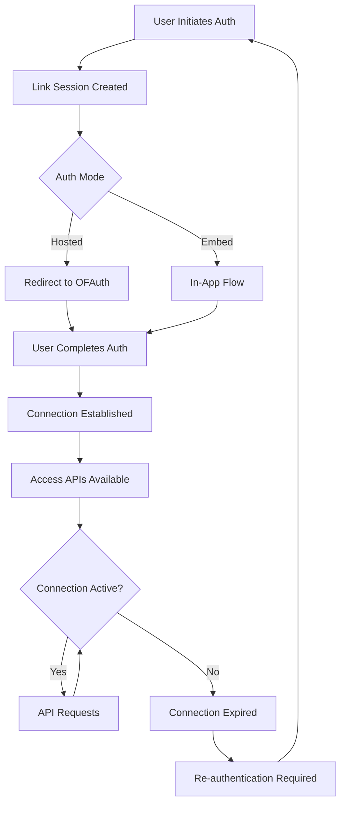

## Overview

The Connections API (`/v2/connections`) manages your connected OnlyFans accounts. Connections are created through [Link](/guides/link/overview) and represent authenticated OnlyFans sessions that can be used with the [Access API](/guides/access).

## Connection Lifecycle

## Connection States

| State | Description |
|-------|-------------|
| `pending` | Authentication in progress |
| `active` | Ready for API access |
| `awaiting_2fa` | Waiting for 2FA verification |
| `expired` | Session ended, re-authentication needed |
| `failed` | Authentication failed, retry required |

## Connection Persistence

Connections are designed to be long-lived but may expire due to:

- OnlyFans session expiration
- User password changes
- User account deactivation
- Extended inactivity
- Security-related revocation

<Tip>
  Set up [webhooks](/guides/webhooks) to receive `connection.expired` events and prompt users to re-authenticate proactively.
</Tip>

## API Reference

### List Connections

Retrieve all connections for your organization.

<Expandable title="GET /v2/connections">

- **Endpoint**: `GET /v2/connections`
- **Query parameters**:

| Parameter | Type    | Description                                           |
| --------- | ------- | ----------------------------------------------------- |
| `limit`   | integer | Maximum number of connections to return (default: 10) |
| `offset`  | integer | Number of connections to skip (default: 0)            |
| `status`  | string  | Filter by status: `active`, `expired`, `awaiting_2fa` |

- **Response**: Returns a paginated list of connection objects with `hasMore` boolean.

</Expandable>

### Delete Connection

Delete a connection and log out the user.

<Expandable title="DELETE /v2/connections/{connectionId}">

- **Endpoint**: `DELETE /v2/connections/{connectionId}`
- **Response**: Returns 200 on success.

<Warning>
  Deleting a connection logs the user out of OnlyFans and stops billing for that connection.
</Warning>

</Expandable>

## Best Practices

<CardGroup cols={2}>
  <Card title="Monitor Status" icon="eye">
    Use webhooks to track connection health and expiration
  </Card>
  <Card title="Handle Expiration" icon="refresh">
    Implement graceful re-authentication flows for expired connections
  </Card>
  <Card title="Store Securely" icon="lock">
    Treat connection IDs as sensitive credentials
  </Card>
  <Card title="Clean Up" icon="trash">
    Delete unused connections to stop billing
  </Card>
</CardGroup>

## Next Steps

<CardGroup cols={3}>
  <Card title="Access API" icon="key" href="/guides/access">
    Use connections to access OnlyFans data
  </Card>
  <Card title="Link API" icon="link" href="/guides/link/overview">
    Create new user connections
  </Card>
  <Card title="Webhooks" icon="bell" href="/guides/webhooks">
    Monitor connection events
  </Card>
</CardGroup>
