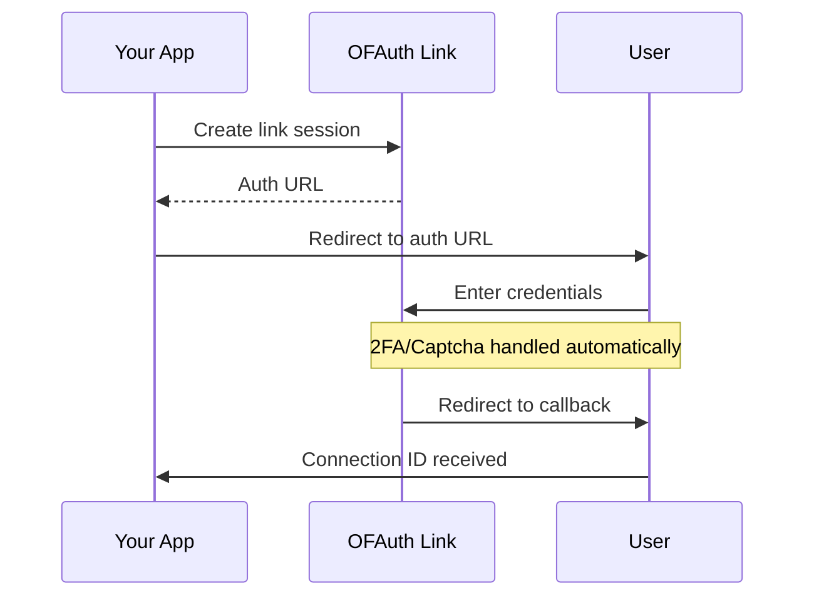

Connect an OnlyFans account to interact with it via the OFAuth API - send messages, create posts, get subscriber data, view earnings, and more.

<Info>
**Using Node.js?** Our [TypeScript SDK](/sdk) provides wrapper methods for Link authentication with built-in error handling.
</Info>

## Prerequisites

<Steps>
  <Step title="OFAuth API Key">
    Get your API key from the [OFAuth Dashboard](https://app.ofauth.com/platform/developers/keys)
  </Step>
  <Step title="Configure Redirect URI">
    Add your callback URL to Allowed Redirect URIs in Dashboard → Developers → API
  </Step>
  <Step title="Configure User Data Permissions">
    Select which OnlyFans data your platform can access in Dashboard → Developers → API → User Data Permissions
  </Step>
</Steps>

---

## Connection Flow



---

## Step 1: Create a Link Session

<CodeGroup>

```javascript Node.js
const response = await fetch("https://api.ofauth.com/v2/link/init", {
  method: "POST",
  headers: {
    apikey: "YOUR_API_KEY",
    "Content-Type": "application/json"
  },
  body: JSON.stringify({
    redirectUrl: "https://yourapp.com/callback",
    clientReferenceId: "your-internal-user-id"  // Optional
  })
})

const { url } = await response.json()
console.log("Send user to:", url)
```

```python Python
import requests

response = requests.post(
    "https://api.ofauth.com/v2/link/init",
    headers={
        "apikey": "YOUR_API_KEY",
        "Content-Type": "application/json"
    },
    json={
        "redirectUrl": "https://yourapp.com/callback",
        "clientReferenceId": "your-internal-user-id"
    }
)

data = response.json()
print("Send user to:", data["url"])
```

```bash cURL
curl -X POST https://api.ofauth.com/v2/link/init \
  -H "apikey: YOUR_API_KEY" \
  -H "Content-Type: application/json" \
  -d '{
    "redirectUrl": "https://yourapp.com/callback",
    "clientReferenceId": "your-internal-user-id"
  }'
```

</CodeGroup>

**Response:**

```json
{
  "url": "https://link.ofauth.com/cs_abc123...",
  "expiresAt": "2024-01-15T10:30:00Z"
}
```

### Session Options

| Option | Type | Description |
|--------|------|-------------|
| `redirectUrl` | string | Callback URL (must be in Allowed Redirect URIs) |
| `clientReferenceId` | string | Your internal user ID for correlation |
| `connectionId` | string | Existing connection ID to reconnect |

---

## Step 2: Redirect User

Send the user to the `url` from Step 1:

```javascript
window.location.href = url
```

The user will:
1. Enter their OnlyFans credentials
2. Complete 2FA if enabled (handled automatically)
3. Solve captcha challenges (handled automatically)

<Tip>
**Embedded Flow**: Want to keep users in your app? Use the [Link Embed Library](/guides/link/embed) for a popup experience.
</Tip>

---

## Step 3: Handle the Callback

After authentication, users are redirected to your URL with query parameters:

```
https://yourapp.com/callback?status=success&connection_id=conn_abc123
```

```javascript
const params = new URLSearchParams(window.location.search)
const status = params.get("status")
const connectionId = params.get("connection_id")

if (status === "success" && connectionId) {
  // Store the connection ID
  await saveConnectionId(userId, connectionId)
  redirect("/dashboard")
} else if (status === "cancelled") {
  const step = params.get("step")
  console.log("User cancelled at:", step)
} else if (status === "error") {
  const errorCode = params.get("error_code")
  console.error("Error:", errorCode)
}
```

### Callback Parameters

| Parameter | Description |
|-----------|-------------|
| `status` | `success`, `cancelled`, or `error` |
| `connection_id` | The connection ID (on success) |
| `client_reference_id` | Your internal ID (if provided) |
| `step` | Where user cancelled: `pre-login`, `login`, `2fa` |
| `error_code` | Error type: `session_expired`, `invalid_credentials`, `account_locked`, `2fa_failed` |

---

## Step 4: Use the Connection

Make API calls with the connection ID:

```javascript
const response = await fetch("https://api.ofauth.com/v2/access/self/me", {
  headers: {
    apikey: "YOUR_API_KEY",
    "x-connection-id": connectionId
  }
})

const account = await response.json()
console.log("Connected as:", account.name)
```

---

## Integration Options

| Option | Best For | Guide |
|--------|----------|-------|
| **Redirect** | Simple setup, server-rendered apps | This page |
| **Embed Popup** | Best UX, stays in your app | [Link Embed](/guides/link/embed) |

---

## Security Best Practices

<CardGroup cols={2}>
  <Card title="Server-Side Verification" icon="shield-check">
    Always verify session status server-side, never trust client-side data
  </Card>
  <Card title="HTTPS Only" icon="lock">
    Use HTTPS for all redirect URLs and API communications
  </Card>
  <Card title="Session Expiry" icon="clock">
    Link sessions expire after 1 hour. Create a new session if expired.
  </Card>
  <Card title="Allowed URIs" icon="list-check">
    Configure exact redirect URLs in your dashboard. No wildcards.
  </Card>
</CardGroup>

---

## Billing

<Info>
You're only charged for **active connections**. Expired connections don't count toward monthly usage—billing resumes only if the user re-authenticates.
</Info>

---

## Next Steps

<CardGroup cols={2}>
  <Card title="Send a Message" icon="paper-plane" href="/guides/how-to/send-message">
    Send your first message to a fan
  </Card>
  <Card title="Create a Post" icon="image" href="/guides/how-to/create-post">
    Create your first post with media
  </Card>
  <Card title="Link Embed Library" icon="window-maximize" href="/guides/link/embed">
    Popup authentication for better UX
  </Card>
  <Card title="Hosted Mode Details" icon="external-link" href="/guides/link/hosted">
    Advanced redirect flow options
  </Card>
</CardGroup>
