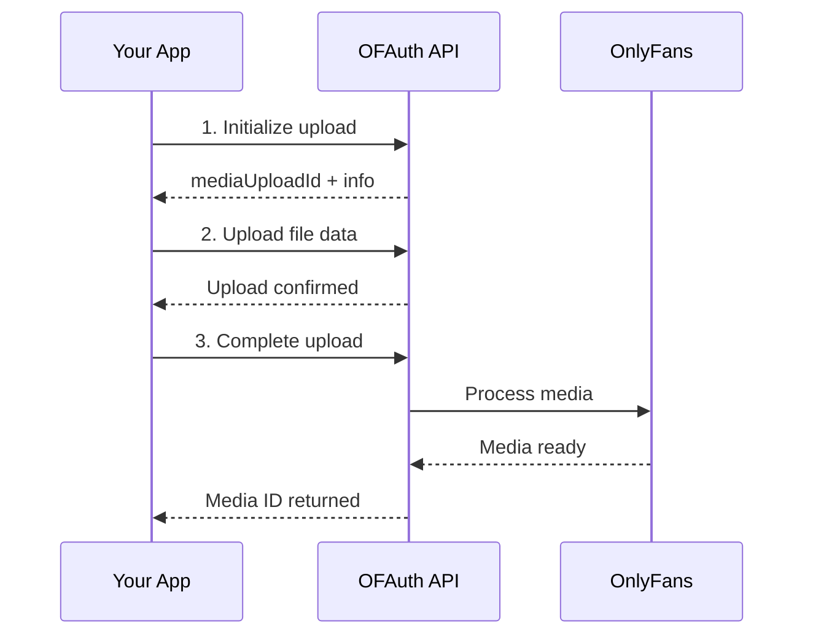

Learn how to upload media to the OnlyFans vault so you can use it in posts and messages.

## Prerequisites

<Check>
  You have a [connected OnlyFans account](/guides/link) with a valid `connectionId`
</Check>

---

## Upload Flow Overview

Uploading media is a multi-step process:



---

## Step 1: Initialize Upload

Tell OFAuth about the file you want to upload:

<CodeGroup>

```javascript Node.js
const response = await fetch("https://api.ofauth.com/v2/access/uploads/init", {
  method: "POST",
  headers: {
    apikey: "YOUR_API_KEY",
    "x-connection-id": "conn_abc123",
    "Content-Type": "application/json"
  },
  body: JSON.stringify({
    filename: "photo.jpg",
    filesize: 1024000,      // File size in bytes
    mimeType: "image/jpeg"
  })
})

const data = await response.json()
console.log("Upload ID:", data.mediaUploadId)

// Check headers for upload info
const totalParts = response.headers.get("x-ofauth-upload-total-parts")
const partSize = response.headers.get("x-ofauth-upload-part-size")
```

```python Python
import requests

response = requests.post(
    "https://api.ofauth.com/v2/access/uploads/init",
    headers={
        "apikey": "YOUR_API_KEY",
        "x-connection-id": "conn_abc123",
        "Content-Type": "application/json"
    },
    json={
        "filename": "photo.jpg",
        "filesize": 1024000,
        "mimeType": "image/jpeg"
    }
)

data = response.json()
total_parts = response.headers.get("x-ofauth-upload-total-parts")
print(f"Upload ID: {data['mediaUploadId']}, Parts: {total_parts}")
```

</CodeGroup>

**Response Headers:**
- `x-ofauth-upload-total-parts` - Number of chunks needed (1 for small files)
- `x-ofauth-upload-part-size` - Size of each chunk (for multi-part uploads)

---

## Step 2: Upload the File

### Single-Part Upload (Small Files)

For files that fit in one part (check `x-ofauth-upload-total-parts` = 1):

```javascript
const fileBuffer = fs.readFileSync("photo.jpg")

const response = await fetch(`https://api.ofauth.com/v2/access/uploads/${mediaUploadId}`, {
  method: "PUT",
  headers: {
    apikey: "YOUR_API_KEY",
    "x-connection-id": "conn_abc123",
    "Content-Type": "image/jpeg"
  },
  body: fileBuffer
})

// Single-part upload auto-completes, returns media info directly
const result = await response.json()
console.log("Media ID:", result.media?.id)
```

### Multi-Part Upload (Large Files)

For larger files, upload in chunks:

```javascript
const PART_SIZE = parseInt(response.headers.get("x-ofauth-upload-part-size"))
const totalParts = parseInt(response.headers.get("x-ofauth-upload-total-parts"))

const fileBuffer = fs.readFileSync("video.mp4")

for (let partNumber = 1; partNumber <= totalParts; partNumber++) {
  const start = (partNumber - 1) * PART_SIZE
  const end = Math.min(start + PART_SIZE, fileBuffer.length)
  const chunk = fileBuffer.slice(start, end)
  
  await fetch(
    `https://api.ofauth.com/v2/access/uploads/${mediaUploadId}/parts/${partNumber}`,
    {
      method: "PUT",
      headers: {
        apikey: "YOUR_API_KEY",
        "x-connection-id": "conn_abc123",
        "Content-Type": "video/mp4"
      },
      body: chunk
    }
  )
  
  console.log(`Uploaded part ${partNumber}/${totalParts}`)
}
```

---

## Step 3: Complete Upload (Multi-Part Only)

For multi-part uploads, call `/complete` after all chunks are uploaded:

```javascript
const response = await fetch("https://api.ofauth.com/v2/access/uploads/complete", {
  method: "POST",
  headers: {
    apikey: "YOUR_API_KEY",
    "x-connection-id": "conn_abc123",
    "Content-Type": "application/json"
  },
  body: JSON.stringify({
    mediaUploadId: mediaUploadId
  })
})

const result = await response.json()
console.log("Media ready! ID:", result.media.id)
```

<Info>
  **Single-part uploads auto-complete.** When `x-ofauth-upload-total-parts` is `1`, the PUT response returns the media directly—no `/complete` call needed.
</Info>

---

## Complete Example

Full upload workflow with progress tracking:

```javascript
const fs = require("fs")

const API_KEY = "YOUR_API_KEY"
const CONNECTION_ID = "conn_abc123"

async function uploadMedia(filePath, mimeType) {
  const headers = {
    apikey: API_KEY,
    "x-connection-id": CONNECTION_ID,
    "Content-Type": "application/json"
  }
  
  // Read file
  const fileBuffer = fs.readFileSync(filePath)
  const filename = filePath.split("/").pop()
  
  console.log(`Uploading ${filename} (${fileBuffer.length} bytes)...`)
  
  // Step 1: Initialize
  const initResponse = await fetch("https://api.ofauth.com/v2/access/uploads/init", {
    method: "POST",
    headers,
    body: JSON.stringify({
      filename,
      filesize: fileBuffer.length,
      mimeType
    })
  })
  
  const { mediaUploadId } = await initResponse.json()
  const totalParts = parseInt(initResponse.headers.get("x-ofauth-upload-total-parts") || "1")
  const partSize = parseInt(initResponse.headers.get("x-ofauth-upload-part-size") || String(fileBuffer.length))
  
  console.log(`Upload ID: ${mediaUploadId}, Parts: ${totalParts}`)
  
  // Step 2: Upload
  if (totalParts === 1) {
    // Single part upload (auto-completes)
    const uploadResponse = await fetch(
      `https://api.ofauth.com/v2/access/uploads/${mediaUploadId}`,
      {
        method: "PUT",
        headers: {
          apikey: API_KEY,
          "x-connection-id": CONNECTION_ID,
          "Content-Type": mimeType
        },
        body: fileBuffer
      }
    )
    
    const result = await uploadResponse.json()
    console.log("✅ Upload complete! Media ID:", result.media?.id || result.mediaUploadId)
    return result
  } else {
    // Multi-part upload
    for (let part = 1; part <= totalParts; part++) {
      const start = (part - 1) * partSize
      const end = Math.min(start + partSize, fileBuffer.length)
      const chunk = fileBuffer.slice(start, end)
      
      await fetch(
        `https://api.ofauth.com/v2/access/uploads/${mediaUploadId}/parts/${part}`,
        {
          method: "PUT",
          headers: {
            apikey: API_KEY,
            "x-connection-id": CONNECTION_ID,
            "Content-Type": mimeType
          },
          body: chunk
        }
      )
      
      console.log(`  Part ${part}/${totalParts} uploaded`)
    }
    
    // Step 3: Complete
    const completeResponse = await fetch("https://api.ofauth.com/v2/access/uploads/complete", {
      method: "POST",
      headers,
      body: JSON.stringify({ mediaUploadId })
    })
    
    const result = await completeResponse.json()
    console.log("✅ Upload complete! Media ID:", result.media?.id)
    return result
  }
}

// Usage
uploadMedia("photo.jpg", "image/jpeg")
uploadMedia("video.mp4", "video/mp4")
```

---

## Supported Formats

| Type | Formats | Max Size |
|------|---------|----------|
| **Images** | JPEG, PNG, GIF, WebP | ~50MB |
| **Videos** | MP4, MOV | ~5GB |
| **Audio** | MP3, M4A | ~50MB |

<Warning>
  Check OnlyFans' current guidelines for exact size limits, as they may change.
</Warning>

---

## Using Uploaded Media

Once uploaded, use the media in posts or messages. You have two options:

### Option 1: Use Upload Reference Directly (Recommended)

Pass the `mediaUploadId` string directly to `mediaItems` - the system resolves it automatically:

```javascript
const { mediaUploadId } = await initUpload(...)
await uploadFile(mediaUploadId, fileBuffer)
await completeUpload({ mediaUploadId })

// Use mediaUploadId directly - no need to extract vault ID!
await fetch("https://api.ofauth.com/v2/access/posts", {
  method: "POST",
  headers,
  body: JSON.stringify({
    text: "New content! 📸",
    mediaItems: [mediaUploadId]  // e.g. "upload:550e8400-e29b-41d4-a716-446655440000"
  })
})
```

<Info>
  Upload references are automatically resolved to vault media IDs by the API. This is the simplest approach.
</Info>

### Option 2: Use Vault Media ID

If you need the vault ID (e.g., to store it for later use), extract it from the complete response:

```javascript
const result = await completeUpload({ mediaUploadId })
const vaultMediaId = result.media.id  // Numeric vault ID

// Use the vault ID
await fetch("https://api.ofauth.com/v2/access/posts", {
  method: "POST",
  headers,
  body: JSON.stringify({
    text: "New content! 📸",
    mediaItems: [vaultMediaId]  // 12345
  })
})
```

### What `mediaItems` Accepts

See the [`mediaItems` reference](/guides/media-items).

<Warning>
  **Single-use**: Upload references are consumed when used. Once you include a `mediaUploadId` in a post or message, it cannot be reused. If you need to use the same media multiple times, store the vault media ID instead.
</Warning>

---

## Check Upload Status

Poll for upload status if needed:

```javascript
const response = await fetch("https://api.ofauth.com/v2/access/uploads/check", {
  method: "POST",
  headers: {
    apikey: "YOUR_API_KEY",
    "x-connection-id": "conn_abc123",
    "Content-Type": "application/json"
  },
  body: JSON.stringify({
    mediaUploadId: mediaUploadId
  })
})

const status = await response.json()
console.log("Status:", status.status)  // "pending", "processing", "ready", "failed"
```

---

## Error Handling

```javascript
try {
  const response = await fetch("https://api.ofauth.com/v2/access/uploads/init", {
    method: "POST",
    headers,
    body: JSON.stringify({ filename, filesize, mimeType })
  })
  
  if (!response.ok) {
    const error = await response.json()
    
    switch (response.status) {
      case 400:
        console.error("Invalid file:", error.message)
        break
      case 413:
        console.error("File too large")
        break
      case 415:
        console.error("Unsupported file type")
        break
      default:
        console.error("Upload failed:", error)
    }
    return
  }
  
  // Continue with upload...
} catch (err) {
  console.error("Network error:", err)
}
```

---

## Tips & Best Practices

<Tip>
  **Retry failed chunks**: If a chunk upload fails, you can retry just that chunk without restarting the entire upload.
</Tip>

<Info>
  **Upload to vault first**: Always upload media before creating posts or messages. You cannot attach external URLs directly.
</Info>

<Warning>
  **Session timeout**: Upload sessions expire after a period of inactivity. Start the complete flow and finish promptly.
</Warning>

---

## Next Steps

<CardGroup cols={2}>
  <Card title="Create a Post" icon="image" href="/guides/how-to/create-post">
    Use uploaded media in posts
  </Card>
  <Card title="Send a Message" icon="paper-plane" href="/guides/how-to/send-message">
    Send media in direct messages
  </Card>
</CardGroup>
