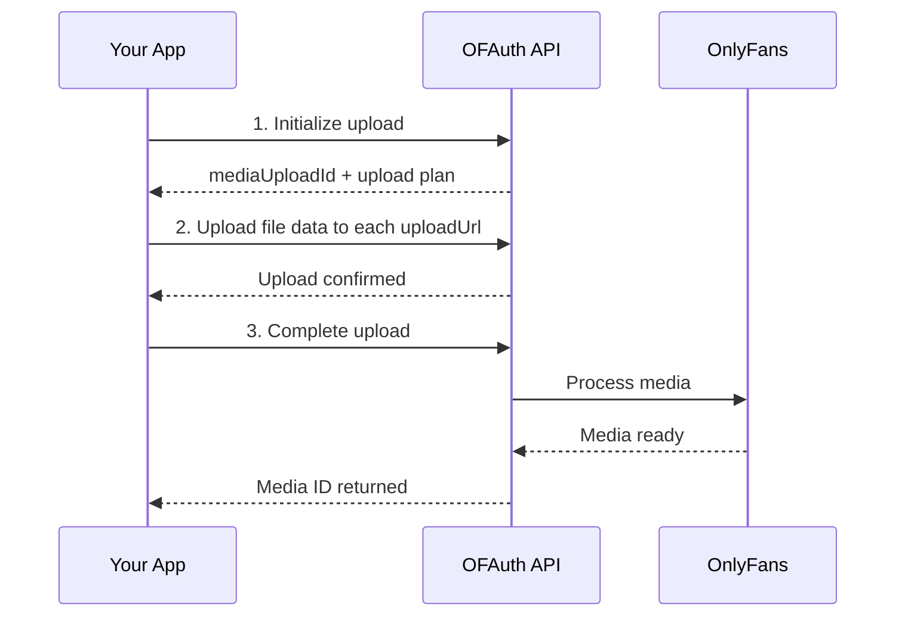

Learn how to upload media to the OnlyFans vault so you can use it in posts and messages.

## Prerequisites

<Check>
  You have a [connected OnlyFans account](/guides/link) with a valid `connectionId`
</Check>

---

## Upload Flow Overview

Uploading media is a multi-step process:


```mermaid
sequenceDiagram
    participant App as Your App
    participant OFAuth as OFAuth API
    participant OF as OnlyFans
    
    App->>OFAuth: 1. Initialize upload
    OFAuth-->>App: mediaUploadId + upload plan
    App->>OFAuth: 2. Upload file data to each uploadUrl
    OFAuth-->>App: Upload confirmed
    App->>OFAuth: 3. Complete upload
    OFAuth->>OF: Process media
    OF-->>OFAuth: Media ready
    OFAuth-->>App: Media ID returned
```

---

## Step 1: Initialize Upload

Tell OFAuth about the file you want to upload:

<CodeGroup>

```javascript Node.js
const response = await fetch("https://api.ofauth.com/v2/access/uploads/init", {
  method: "POST",
  headers: {
    apikey: "YOUR_API_KEY",
    "x-connection-id": "conn_abc123",
    "Content-Type": "application/json"
  },
  body: JSON.stringify({
    filename: "photo.jpg",
    size: 1024000,
    contentType: "image/jpeg"
  })
})

const upload = await response.json()
console.log("Upload ID:", upload.mediaUploadId)
console.log("Parts:", upload.totalParts)
```

```python Python
import requests

response = requests.post(
    "https://api.ofauth.com/v2/access/uploads/init",
    headers={
        "apikey": "YOUR_API_KEY",
        "x-connection-id": "conn_abc123",
        "Content-Type": "application/json"
    },
    json={
        "filename": "photo.jpg",
        "size": 1024000,
        "contentType": "image/jpeg"
    }
)

upload = response.json()
print(f"Upload ID: {upload['mediaUploadId']}, Parts: {upload['totalParts']}")
```

</CodeGroup>

**Request body:**

| Field | Type | Required | Description |
|-------|------|----------|-------------|
| `filename` | string | Yes | Original file name, including extension |
| `size` | number | Yes | File size in bytes |
| `contentType` | string | Yes | MIME type, such as `image/jpeg` or `video/mp4` |
| `vaultUpload` | object | No | Options for automatic vault upload workflows |

**Example response:**

```json
{
  "mediaUploadId": "upload:550e8400-e29b-41d4-a716-446655440000",
  "uploadType": "multipart",
  "totalParts": 2,
  "partSize": 5242880,
  "expiresAt": "2026-04-29T10:18:48.831Z",
  "parts": [
    {
      "partNumber": 1,
      "uploadUrl": "https://api.ofauth.com/v2/access/uploads/upload%3A550e8400-e29b-41d4-a716-446655440000/parts/1",
      "byteRange": {
        "start": 0,
        "end": 5242879
      }
    },
    {
      "partNumber": 2,
      "uploadUrl": "https://api.ofauth.com/v2/access/uploads/upload%3A550e8400-e29b-41d4-a716-446655440000/parts/2",
      "byteRange": {
        "start": 5242880,
        "end": 6825498
      }
    }
  ],
  "completeUrl": "https://api.ofauth.com/v2/access/uploads/complete"
}
```

**Response fields:**

| Field | Type | Description |
|-------|------|-------------|
| `mediaUploadId` | string | Upload session ID. You can later pass this value directly in `mediaItems`. |
| `uploadType` | `"single"` or `"multipart"` | Whether the upload uses one request or multiple part requests. |
| `totalParts` | number | Number of file parts to upload. |
| `partSize` | number | Maximum bytes per part. |
| `expiresAt` | string | ISO timestamp when the upload session expires. |
| `parts` | array | Ordered upload steps. Upload each `byteRange` to its matching `uploadUrl`. |
| `completeUrl` | string | URL to call after multipart uploads. Omitted for single-part uploads. |

<Info>
  The response also includes `x-ofauth-upload-total-parts` and `x-ofauth-upload-part-size` headers for backward compatibility. Prefer the response body for new integrations.
</Info>

---

## Step 2: Upload the File

### Single-Part Upload (Small Files)

For files that fit in one part (`upload.uploadType` is `"single"`), upload the whole file to the first `uploadUrl`:

```javascript
const fileBuffer = fs.readFileSync("photo.jpg")
const [part] = upload.parts

const response = await fetch(part.uploadUrl, {
  method: "PUT",
  headers: {
    apikey: "YOUR_API_KEY",
    "x-connection-id": "conn_abc123",
    "Content-Type": "image/jpeg"
  },
  body: fileBuffer
})

// Single-part upload auto-completes, returns media info directly
const result = await response.json()
console.log("Media ID:", result.media?.id)
```

**Single-part PUT response:**

```json
{
  "mediaUploadId": "upload:550e8400-e29b-41d4-a716-446655440000",
  "media": {
    "id": 12345,
    "type": "photo",
    "files": {}
  }
}
```

### Multi-Part Upload (Large Files)

For larger files, upload each `parts[]` entry. Slice the file using the provided `byteRange`, then send that chunk to the entry's `uploadUrl`:

```javascript
const fileBuffer = fs.readFileSync("video.mp4")

for (const part of upload.parts) {
  const chunk = fileBuffer.slice(part.byteRange.start, part.byteRange.end + 1)
  
  const response = await fetch(part.uploadUrl, {
    method: "PUT",
    headers: {
      apikey: "YOUR_API_KEY",
      "x-connection-id": "conn_abc123",
      "Content-Type": "video/mp4"
    },
    body: chunk
  })

  if (!response.ok) {
    throw new Error(`Part ${part.partNumber} failed: ${await response.text()}`)
  }
  
  console.log(`Uploaded part ${part.partNumber}/${upload.totalParts}`)
}
```

**Multipart part PUT response:**

```json
{
  "mediaUploadId": "upload:550e8400-e29b-41d4-a716-446655440000",
  "partNumber": 1,
  "etag": "\"abc123\""
}
```

---

## Step 3: Complete Upload (Multi-Part Only)

For multi-part uploads, call `completeUrl` after all chunks are uploaded:

```javascript
const response = await fetch(upload.completeUrl, {
  method: "POST",
  headers: {
    apikey: "YOUR_API_KEY",
    "x-connection-id": "conn_abc123",
    "Content-Type": "application/json"
  },
  body: JSON.stringify({
    mediaUploadId
  })
})

const result = await response.json()
console.log("Media ready! ID:", result.media.id)
```

**Request body:**

```json
{
  "mediaUploadId": "upload:550e8400-e29b-41d4-a716-446655440000"
}
```

**Response body:**

```json
{
  "mediaUploadId": "upload:550e8400-e29b-41d4-a716-446655440000",
  "media": {
    "id": 12345,
    "type": "video",
    "files": {}
  }
}
```

<Info>
  **Single-part uploads auto-complete.** When `uploadType` is `"single"`, the PUT response returns the media directly. Do not call `/complete`.
</Info>

---

## Complete Example

Full upload workflow with progress tracking:

```javascript
const fs = require("fs")

const API_KEY = "YOUR_API_KEY"
const CONNECTION_ID = "conn_abc123"

async function uploadMedia(filePath, mimeType) {
  const headers = {
    apikey: API_KEY,
    "x-connection-id": CONNECTION_ID,
    "Content-Type": "application/json"
  }
  
  // Read file
  const fileBuffer = fs.readFileSync(filePath)
  const filename = filePath.split("/").pop()
  
  console.log(`Uploading ${filename} (${fileBuffer.length} bytes)...`)
  
  // Step 1: Initialize
  const initResponse = await fetch("https://api.ofauth.com/v2/access/uploads/init", {
    method: "POST",
    headers,
    body: JSON.stringify({
      filename,
      size: fileBuffer.length,
      contentType: mimeType
    })
  })
  
  const upload = await initResponse.json()
  const { mediaUploadId } = upload
  
  console.log(`Upload ID: ${mediaUploadId}, Parts: ${upload.totalParts}`)
  
  // Step 2: Upload
  if (upload.uploadType === "single") {
    // Single part upload (auto-completes)
    const [part] = upload.parts
    const uploadResponse = await fetch(part.uploadUrl, {
      method: "PUT",
      headers: {
        apikey: API_KEY,
        "x-connection-id": CONNECTION_ID,
        "Content-Type": mimeType
      },
      body: fileBuffer
    })
    
    const result = await uploadResponse.json()
    console.log("✅ Upload complete! Media ID:", result.media?.id || result.mediaUploadId)
    return result
  } else {
    // Multi-part upload
    for (const part of upload.parts) {
      const chunk = fileBuffer.slice(part.byteRange.start, part.byteRange.end + 1)
      
      const partResponse = await fetch(part.uploadUrl, {
        method: "PUT",
        headers: {
          apikey: API_KEY,
          "x-connection-id": CONNECTION_ID,
          "Content-Type": mimeType
        },
        body: chunk
      })

      if (!partResponse.ok) {
        throw new Error(`Part ${part.partNumber} failed: ${await partResponse.text()}`)
      }
      
      console.log(`  Part ${part.partNumber}/${upload.totalParts} uploaded`)
    }
    
    // Step 3: Complete
    const completeResponse = await fetch(upload.completeUrl, {
      method: "POST",
      headers,
      body: JSON.stringify({ mediaUploadId })
    })
    
    const result = await completeResponse.json()
    console.log("✅ Upload complete! Media ID:", result.media?.id)
    return result
  }
}

// Usage
uploadMedia("photo.jpg", "image/jpeg")
uploadMedia("video.mp4", "video/mp4")
```

---

## Supported Formats

| Type | Formats | Max Size |
|------|---------|----------|
| **Images** | JPEG, PNG, GIF, WebP | ~50MB |
| **Videos** | MP4, MOV | ~5GB |
| **Audio** | MP3, M4A | ~50MB |

<Warning>
  Check OnlyFans' current guidelines for exact size limits, as they may change.
</Warning>

---

## Using Uploaded Media

Once uploaded, use the media in posts or messages. You have two options:

### Option 1: Use Upload Reference Directly (Recommended)

Pass the `mediaUploadId` string directly to `mediaItems` - the system resolves it automatically:

```javascript
const uploadResult = await uploadMedia("photo.jpg", "image/jpeg")
const { mediaUploadId } = uploadResult

// Use mediaUploadId directly - no need to extract vault ID!
await fetch("https://api.ofauth.com/v2/access/posts", {
  method: "POST",
  headers,
  body: JSON.stringify({
    text: "New content! 📸",
    mediaItems: [mediaUploadId]  // e.g. "upload:550e8400-e29b-41d4-a716-446655440000"
  })
})
```

<Info>
  Upload references are automatically resolved to vault media IDs by the API. This is the simplest approach.
</Info>

### Option 2: Use Vault Media ID

If you need the vault ID (e.g., to store it for later use), extract it from the complete response:

```javascript
const result = await uploadMedia("photo.jpg", "image/jpeg")
const vaultMediaId = result.media.id  // Numeric vault ID

// Use the vault ID
await fetch("https://api.ofauth.com/v2/access/posts", {
  method: "POST",
  headers,
  body: JSON.stringify({
    text: "New content! 📸",
    mediaItems: [vaultMediaId]  // 12345
  })
})
```

### What `mediaItems` Accepts

See the [`mediaItems` reference](/guides/media-items).

<Warning>
  **Single-use**: Upload references are consumed when used. Once you include a `mediaUploadId` in a post or message, it cannot be reused. If you need to use the same media multiple times, store the vault media ID instead.
</Warning>

---

## Check for Existing Uploaded Media

Use `/uploads/check` to see if media with a known upload ETag and size already exists in the vault:

```javascript
const response = await fetch("https://api.ofauth.com/v2/access/uploads/check", {
  method: "POST",
  headers: {
    apikey: "YOUR_API_KEY",
    "x-connection-id": "conn_abc123",
    "Content-Type": "application/json"
  },
  body: JSON.stringify({
    etag: "\"abc123\"",
    size: 1024000
  })
})

const result = await response.json()
console.log("Exists:", result.exists)
console.log("Media:", result.media)
```

**Request body:**

| Field | Type | Required | Description |
|-------|------|----------|-------------|
| `etag` | string | Yes | ETag returned by a previous upload response |
| `size` | number | Yes | Uploaded file size in bytes |

**Response body:**

```json
{
  "exists": true,
  "media": {
    "id": 12345,
    "type": "photo",
    "files": {}
  }
}
```

---

## Error Handling

```javascript
try {
  const response = await fetch("https://api.ofauth.com/v2/access/uploads/init", {
    method: "POST",
    headers,
    body: JSON.stringify({ filename, size: fileBuffer.length, contentType: mimeType })
  })
  
  if (!response.ok) {
    const error = await response.json()
    
    switch (response.status) {
      case 400:
        console.error("Invalid upload request:", error.error || error.message)
        break
      case 413:
        console.error("File too large")
        break
      case 415:
        console.error("Unsupported file type")
        break
      default:
        console.error("Upload failed:", error)
    }
    return
  }
  
  // Continue with upload...
  const upload = await response.json()
  for (const part of upload.parts) {
    // Upload each byte range to part.uploadUrl
  }
} catch (err) {
  console.error("Network error:", err)
}
```

---

## Tips & Best Practices

<Tip>
  **Retry failed chunks**: If a chunk upload fails, you can retry just that chunk without restarting the entire upload.
</Tip>

<Info>
  **Upload to vault first for reuse**: Vault uploads give you a media ID or upload reference that you can attach to posts and messages.
</Info>

<Warning>
  **Session timeout**: Upload sessions expire after a period of inactivity. Start the complete flow and finish promptly.
</Warning>

---

## Next Steps

<CardGroup cols={2}>
  <Card title="Create a Post" icon="image" href="/guides/how-to/create-post">
    Use uploaded media in posts
  </Card>
  <Card title="Send a Message" icon="paper-plane" href="/guides/how-to/send-message">
    Send media in direct messages
  </Card>
</CardGroup>
