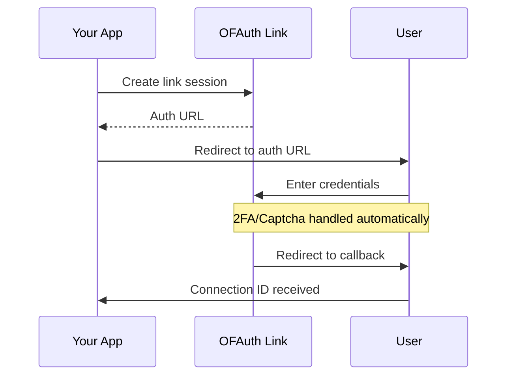

Connect OnlyFans accounts to your platform securely. OFAuth handles credentials on hosted pages—you receive a Connection ID for API access.

<Warning>
  **Use Sandbox for testing!** Before testing with real OnlyFans accounts, use [Sandbox test credentials](/getting-started/sandbox). Too many login attempts on production accounts can trigger OnlyFans "suspicious activity" detection.
</Warning>

## Choose Your Integration

<CardGroup cols={2}>
  <Card title="Redirect Flow" icon="external-link" href="#redirect-flow">
    Redirect users to OFAuth's authentication pages. Simple to implement.
  </Card>
  <Card title="Popup Flow" icon="window" href="#popup-flow-embed-library">
    Show authentication in a popup. Best user experience.
  </Card>
</CardGroup>

---

## How It Works



1. **Create a Link session** with your redirect URL
2. **Redirect the user** to OFAuth's secure authentication page
3. **User authenticates** on OFAuth (2FA and captcha handled automatically)
4. **Receive Connection ID** via callback URL or webhook

---

## Prerequisites

<Steps>
  <Step title="Get API Key">
    Get your API key from [OFAuth Dashboard > Developers > API Keys](https://app.ofauth.com/platform/developers/keys)
  </Step>
  <Step title="Configure Redirect URI">
    Add your callback URL to Allowed Redirect URIs in Dashboard > Developers > API
  </Step>
  <Step title="Set Permissions">
    Select which OnlyFans data your platform can access in Dashboard > Developers > API > User Data Permissions
  </Step>
</Steps>

---

## Redirect Flow

The simplest integration—redirect users to OFAuth's hosted authentication pages.

### Step 1: Create a Link Session

<CodeGroup>

```javascript Node.js
const response = await fetch("https://api.ofauth.com/v2/link/init", {
  method: "POST",
  headers: {
    apikey: "YOUR_API_KEY",
    "Content-Type": "application/json"
  },
  body: JSON.stringify({
    redirectUrl: "https://yourapp.com/callback",
    clientReferenceId: "your-internal-user-id"
  })
})

const { url } = await response.json()
console.log("Send user to:", url)
```

```python Python
import requests

response = requests.post(
    "https://api.ofauth.com/v2/link/init",
    headers={
        "apikey": "YOUR_API_KEY",
        "Content-Type": "application/json"
    },
    json={
        "redirectUrl": "https://yourapp.com/callback",
        "clientReferenceId": "your-internal-user-id"
    }
)

data = response.json()
print("Send user to:", data["url"])
```

```bash cURL
curl -X POST https://api.ofauth.com/v2/link/init \
  -H "apikey: YOUR_API_KEY" \
  -H "Content-Type: application/json" \
  -d '{
    "redirectUrl": "https://yourapp.com/callback",
    "clientReferenceId": "your-internal-user-id"
  }'
```

</CodeGroup>

**Response:**

```json
{
  "url": "https://link.ofauth.com/cs_abc123...",
  "expiresAt": "2024-01-15T10:30:00Z"
}
```

### Session Options

| Option | Type | Description |
|--------|------|-------------|
| `redirectUrl` | string | Callback URL (must be in Allowed Redirect URIs) |
| `clientReferenceId` | string | Your internal user ID for correlation |
| `connectionId` | string | Existing connection ID to reconnect |

### Step 2: Redirect User

```javascript
window.location.href = url
```

The user will enter their credentials, complete 2FA if enabled, and solve captchas—all handled automatically by OFAuth.

### Step 3: Handle the Callback

After authentication, users are redirected to your URL:

```
https://yourapp.com/callback?status=success&connection_id=conn_abc123
```

```javascript
const params = new URLSearchParams(window.location.search)
const status = params.get("status")
const connectionId = params.get("connection_id")

if (status === "success" && connectionId) {
  await saveConnectionId(userId, connectionId)
  redirect("/dashboard")
} else if (status === "cancelled") {
  console.log("User cancelled at:", params.get("step"))
} else if (status === "error") {
  console.error("Error:", params.get("error_code"))
}
```

### Callback Parameters

| Parameter | Description |
|-----------|-------------|
| `status` | `success`, `cancelled`, or `error` |
| `connection_id` | The connection ID (on success) |
| `client_reference_id` | Your internal ID (if provided) |
| `step` | Where user cancelled: `pre-login`, `login`, `2fa` |
| `error_code` | Error type: `session_expired`, `invalid_credentials`, `account_locked`, `2fa_failed` |

---

## Popup Flow (Embed Library)

Keep users in your app with a popup authentication experience.

### Installation

<CodeGroup>
```bash npm
npm install @ofauth/link-embed
```

```html CDN
<script
  src="https://unpkg.com/@ofauth/link-embed/dist/embed.global.js"
  defer
  data-auto-init
></script>
```
</CodeGroup>

### JavaScript Library Usage

```javascript
import { OFAuthLinkEmbed } from '@ofauth/link-embed';

// Create a handler
const handler = OFAuthLinkEmbed.create({
  theme: 'auto',
  async onSuccess(metadata) {
    console.log('Connected:', metadata.connection.id);
    await storeConnection(metadata.connection.id);
  },
  onClose(metadata) {
    console.log('Closed:', metadata.type);
  },
  async onInvalidSession() {
    // Session expired, create a new one
    const response = await fetch("/api/create-link-session");
    const { url } = await response.json();
    handler.open(url);
  }
});

// Open the authentication popup
async function connectOnlyFans() {
  const response = await fetch("/api/create-link-session");
  const { url } = await response.json();
  handler.open(url);
}
```

### Configuration Options

| Option | Type | Description |
|--------|------|-------------|
| `theme` | `'light' \| 'dark' \| 'auto'` | Theme for the interface (default: 'auto') |
| `onSuccess` | `(metadata) => void` | Called when authentication succeeds |
| `onClose` | `(metadata) => void` | Called when user closes the embed |
| `onInvalidSession` | `() => void` | Called when session expires |

### Success Metadata

```typescript
interface SuccessMetadata {
  successUrl: string;
  connection: {
    id: string;         // Connection ID to store
    userData: {
      id: string;
      name: string;
      username: string;
      avatar: string;
    };
  };
}
```

### Global Script (No Build)

```html
<a
  data-ofauth-link
  href="https://link.ofauth.com/cs_xxxxxxxxx"
  data-ofauth-theme="auto"
>
  Connect OnlyFans Account
</a>

<script
  src="https://unpkg.com/@ofauth/link-embed/dist/embed.global.js"
  defer
  data-auto-init
></script>

<script>
  document.querySelector('[data-ofauth-link]')
    .addEventListener('success', (e) => {
      console.log('Connected:', e.detail.metadata.connection.id);
    });
</script>
```

---

## Use the Connection

Once you have a Connection ID, make API calls:

```javascript
const response = await fetch("https://api.ofauth.com/v2/access/self", {
  headers: {
    apikey: "YOUR_API_KEY",
    "x-connection-id": connectionId
  }
})

const account = await response.json()
console.log("Connected as:", account.name)
```

---

## Reconnecting Expired Connections

When a connection expires, reconnect without creating duplicates:

```javascript
const response = await fetch("https://api.ofauth.com/v2/link/init", {
  method: "POST",
  headers: {
    apikey: "YOUR_API_KEY",
    "Content-Type": "application/json"
  },
  body: JSON.stringify({
    connectionId: "conn_abc123xyz", // Existing connection ID
    redirectUrl: "https://yourapp.com/callback"
  })
})
```

The existing connection is updated with fresh session data—same Connection ID, no duplicates.

---

## Security Best Practices

<CardGroup cols={2}>
  <Card title="Server-Side Verification" icon="shield-check">
    Always verify session status server-side, never trust client-side data
  </Card>
  <Card title="HTTPS Only" icon="lock">
    Use HTTPS for all redirect URLs and API communications
  </Card>
  <Card title="Session Expiry" icon="clock">
    Link sessions expire after 1 hour. Create a new session if expired.
  </Card>
  <Card title="Allowed URIs" icon="list-check">
    Configure exact redirect URLs in your dashboard. No wildcards.
  </Card>
</CardGroup>

---

## Troubleshooting

<AccordionGroup>
  <Accordion title="Session Expired">
    Link sessions expire after 1 hour. Create a new session with `/v2/link/init`.
  </Accordion>
  <Accordion title="Invalid Redirect URL">
    Add the URL to Allowed Redirect URIs in Dashboard > Developers > API.
  </Accordion>
  <Accordion title="Popup Blocked">
    Ensure the popup is triggered by a user action (click event), not automatically.
  </Accordion>
  <Accordion title="CSP/CORS Issues (Embed)">
    Add your domain to Allowed Origins in the OFAuth dashboard.
  </Accordion>
</AccordionGroup>

---

## Next Steps

<CardGroup cols={2}>
  <Card title="Handle Webhooks" icon="webhook" href="/reference/webhooks">
    Get notified when connections change
  </Card>
  <Card title="API Reference" icon="terminal" href="/api-reference/link/overview">
    Full Link API documentation
  </Card>
</CardGroup>
