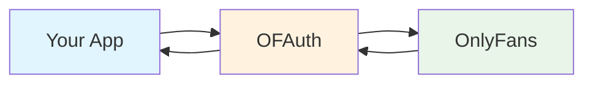

## What is OFAuth?

OFAuth is the infrastructure layer that powers OnlyFans integrations - **think Plaid for OnlyFans**. We handle authentication, request signing, session management, and API complexity so you can focus on building features that generate revenue.

<CardGroup cols={2}>
	<Card title="Enterprise Security" icon="shield-check">
		Bank-grade encryption and automatic session management protect your users' data
	</Card>
	<Card title="Ship 10x Faster" icon="rocket">
		Deploy your first OnlyFans feature in days, not months
	</Card>
	<Card title="Always Up-to-Date" icon="refresh">
		Dynamic rules engine adapts to OnlyFans changes automatically
	</Card>
	<Card title="Save $$$ in Dev Costs" icon="trending-down">
		Skip months of infrastructure development
	</Card>
</CardGroup>

---

## Start Building

<CardGroup cols={3}>
	<Card title="Quick Start" icon="rocket" href="/getting-started/quickstart/index">
		**10 minutes** - From zero to working integration with step-by-step guidance
	</Card>
	<Card title="TypeScript SDK" icon="code" href="/sdk/quickstart">
		**5 minutes** - Install and configure our full-featured SDK
	</Card>
	<Card title="Create Account" icon="user-plus" href="https://ofauth.com/platform">
		**2 minutes** - Sign up and get your API keys
	</Card>
</CardGroup>

<Info>
	**Not sure where to start?** Check out [Core Concepts](/getting-started/concepts) to understand how OFAuth works, or [Choose Your Path](/getting-started/choose-your-path) to pick the right integration approach for your stack.
</Info>

---

## What You Can Build

Build powerful OnlyFans integrations across these popular use cases:

<CardGroup cols={3}>
	<Card title="Creator Dashboards" icon="chart-line">
		Analytics, content management, and performance insights for creators
	</Card>
	<Card title="Subscriber Management" icon="users">
		Tools to organize and communicate with subscribers at scale
	</Card>
	<Card title="Content Automation" icon="calendar">
		Scheduling, publishing, and workflow automation solutions
	</Card>
	<Card title="Message Management" icon="message-bot">
		Automated fan interactions and response management systems
	</Card>
	<Card title="Revenue Analytics" icon="trending-up">
		Pricing optimization and promotional effectiveness tools
	</Card>
	<Card title="Multi-Platform Tools" icon="grid">
		Integrate OnlyFans with other creator economy platforms
	</Card>
</CardGroup>

---

## How It Works

<Steps>
	<Step title="Connect Users">
		Use the **Link API** to authenticate OnlyFans users. They log in on our secure hosted page.
	</Step>
	<Step title="Get a Connection ID">
		After authentication, you receive a Connection ID - a simple token representing the user's account.
	</Step>
	<Step title="Access Data">
		Use the **Access API** with the Connection ID to fetch OnlyFans data. We handle signing and session management.
	</Step>
</Steps>

<Tip>
	Want to understand this better? Read [Core Concepts](/getting-started/concepts) for a complete explanation of Link, Access, Connections, and more.
</Tip>

---

## Explore the Docs

<CardGroup cols={2}>
	<Card title="Integration Guides" icon="book" href="/guides/link/overview">
		Step-by-step guides for Link, Access, and Webhooks
	</Card>
	<Card title="API Reference" icon="square-terminal" href="/api-reference/access/overview">
		Complete endpoint documentation with examples
	</Card>
	<Card title="SDK Documentation" icon="code" href="/sdk">
		TypeScript SDK with full IntelliSense support
	</Card>
	<Card title="Going to Production" icon="shield" href="/getting-started/production-considerations">
		Critical reliability and risk management information
	</Card>
</CardGroup>

---

## Built by Industry Pioneers

OFAuth was founded by the first person to reverse engineer OnlyFans' request signing algorithm. Our team has built and scaled multiple products in the creator economy.

Every feature, security measure, and optimization has been battle-tested by thousands of users. When you choose OFAuth, you're getting the collective knowledge from the industry's most experienced OnlyFans integration experts.

---

## Need Help?

<CardGroup cols={2}>
	<Card title="Join Community" icon="discord" href="https://discord.gg/ofauth">
		Connect with developers and get community support
	</Card>
	<Card title="Contact Support" icon="envelope" href="mailto:support@ofauth.com">
		Get direct help from our technical team
	</Card>
</CardGroup>

<Tip>
	Compare our products on the marketing site:
	[Link](https://ofauth.com/products/link),
	[Access](https://ofauth.com/products/access),
	[SDK](https://ofauth.com/products/sdk), and
	[Dynamic Rules](https://ofauth.com/products/dynamic-rules).
</Tip>
