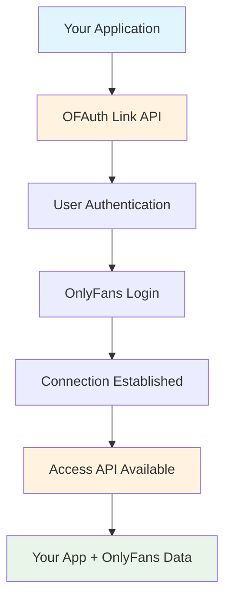

## What is OFAuth?

OFAuth provides the most comprehensive and secure way to integrate OnlyFans
authentication and data access into your applications. Our platform handles the
complexity of OnlyFans integration so you can focus on building great user
experiences.

### Why Choose OFAuth?

<CardGroup cols={2}>
	<Card title="Enterprise Security" icon="shield-check">
		Bank-grade encryption and security practices protect your users' data with
		automatic session management
	</Card>
	<Card title="Simple Integration" icon="code">
		Get started in minutes with our hosted authentication or use our APIs for
		full control
	</Card>
	<Card title="Always Up-to-Date" icon="refresh">
		Dynamic rules engine automatically adapts to OnlyFans changes - no code
		updates required
	</Card>
	<Card title="Production Ready" icon="gauge-high">
		99.9% uptime with global proxy network and intelligent caching for optimal
		performance
	</Card>
</CardGroup>

## Built by Industry Pioneers

OFAuth was founded by the first person to reverse engineer OnlyFans' request signing algorithm. Our team has built and scaled multiple products and services in the creator economy, helping others do the same along the way.

OFAuth represents the culmination of years of production experience - every feature, security measure, and optimization has been battle-tested by thousands of users in real-world applications. When you choose OFAuth, you're not just getting an API - you're getting the collective knowledge and proven solutions from the industry's most experienced OnlyFans integration experts.

## Get Started

<CardGroup cols={2}>
	<Card title="Quick Start" icon="rocket" href="/quickstart">
		**New to OFAuth?** Get from zero to working integration in under 10 minutes
	</Card>
	<Card title="OnlyFans SDK" icon="code" href="/sdk">
		**Want a Node.js SDK?** Get started with our comprehensive TypeScript SDK
	</Card>
	<Card title="Create Account" icon="user-plus" href="https://ofauth.com/platform">
		**Ready to build?** Sign up for free and get your API keys in minutes
	</Card>
	<Card title="Authentication Guide" icon="link" href="/guides/link/overview">
		**Need integration help?** Choose between hosted or API mode authentication
	</Card>
	<Card title="Access API" icon="database" href="/guides/access">
		**Want direct API access?** Use our proxied API for any programming language
	</Card>
	<Card title="API Reference" icon="key" href="/api-reference/overview">
		**Want technical details?** Complete API documentation with examples
	</Card>
</CardGroup>

## What You Can Build

Build powerful OnlyFans integrations across these popular use cases:

<CardGroup cols={3}>
	<Card title="Creator Dashboards" icon="chart-line">
		Analytics, content management, and performance insights for creators
	</Card>
	<Card title="Subscriber Management" icon="users">
		Tools to organize and communicate with subscribers at scale
	</Card>
	<Card title="Content Automation" icon="calendar">
		Scheduling, publishing, and workflow automation solutions
	</Card>
	<Card title="Message Management" icon="message-bot">
		Automated fan interactions and response management systems
	</Card>
	<Card title="Revenue Analytics" icon="trending-up">
		Pricing optimization and promotional effectiveness tools
	</Card>
	<Card title="Multi-Platform Tools" icon="grid">
		Integrate OnlyFans with other creator economy platforms
	</Card>
</CardGroup>

<Info>
	**Building for Production?** Before deploying your OnlyFans integration, review our [Production Considerations](/getting-started/production-considerations) guide for critical reliability and risk management information.
</Info>

## Integration Flow Overview

Here's how OFAuth works at a high level:

1. **Initialize** - Your app creates an authentication session
2. **Authenticate** - User securely logs in through OFAuth
3. **Connect** - OFAuth establishes a secure connection to OnlyFans
4. **Access** - Your app can now access OnlyFans data on behalf of the user

## Need Help?

<CardGroup cols={2}>
	<Card title="Join Community" icon="discord" href="https://discord.gg/ofauth">
		Connect with other developers and get support from the community
	</Card>
	<Card title="Contact Support" icon="envelope" href="mailto:support@ofauth.com">
		Get direct help from our technical team
	</Card>
</CardGroup>

---

<Info>
	**Ready to start?** Most developers complete their first integration within an
	hour using our [Quick Start guide](/quickstart).
</Info>
