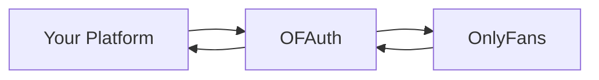

## The OnlyFans API for Platforms

OFAuth is infrastructure that lets you integrate OnlyFans into your platform—without reverse engineering, credential handling, or maintenance headaches. Think **Plaid, but for OnlyFans**.

<CardGroup cols={2}>
  <Card title="I'm evaluating OFAuth" icon="magnifying-glass" href="/overview/services">
    Understand how OFAuth works, security model, and why platforms choose us
  </Card>
  <Card title="I'm ready to build" icon="rocket" href="/quickstart">
    Get your first API call working in under 2 minutes
  </Card>
</CardGroup>

---

## What You Can Build

<CardGroup cols={3}>
  <Card title="Messaging & Chats" icon="messages" href="/use-cases/messaging">
    Send messages, manage conversations, mass messaging at scale
  </Card>
  <Card title="Fans & Subscribers" icon="users" href="/use-cases/fans">
    List fans, track subscriptions, manage user lists
  </Card>
  <Card title="Content & Posts" icon="image" href="/use-cases/content">
    Create posts, schedule content, manage stories
  </Card>
  <Card title="Media & Vault" icon="photo-film" href="/use-cases/media">
    Upload media, access vault, embed content
  </Card>
  <Card title="Earnings & Analytics" icon="chart-line" href="/use-cases/earnings">
    Track revenue, view transactions, request payouts
  </Card>
  <Card title="Account Management" icon="user-gear" href="/use-cases/account">
    Profile settings, notifications, account configuration
  </Card>
</CardGroup>

---

## How It Works

<Steps>
  <Step title="Connect accounts via Link">
    Users authenticate on OFAuth's secure hosted page. You never touch credentials.
  </Step>
  <Step title="Receive a Connection ID">
    After auth, you get a simple token representing that OnlyFans account.
  </Step>
  <Step title="Access data via API">
    Use the Connection ID to fetch data, send messages, or take any action.
  </Step>
</Steps>

<Tip>
  **No credentials on your servers.** OFAuth handles authentication, session management, and request signing. You just use simple REST APIs.
</Tip>

---

## Why Teams Choose OFAuth

<CardGroup cols={2}>
  <Card title="Built for Platforms" icon="building">
    Multi-tenant architecture designed for SaaS products managing multiple OnlyFans accounts
  </Card>
  <Card title="Enterprise Security" icon="shield-check">
    Bank-grade encryption, no credential storage on your servers, SOC 2 compliant infrastructure
  </Card>
  <Card title="Always Current" icon="rotate">
    Our dynamic rules engine adapts to OnlyFans API changes automatically—zero maintenance for you
  </Card>
  <Card title="Full TypeScript SDK" icon="code">
    Type-safe SDK with IntelliSense, automatic retries, and structured error handling
  </Card>
</CardGroup>

---

## Quick Links

<CardGroup cols={2}>
  <Card title="2-Minute Quickstart" icon="bolt" href="/quickstart">
    From zero to working API call
  </Card>
  <Card title="API Reference" icon="square-terminal" href="/api-reference/access/overview">
    Complete endpoint documentation
  </Card>
  <Card title="TypeScript SDK" icon="npm" href="/sdk">
    Install and configure the SDK
  </Card>
  <Card title="Use Case Guides" icon="book" href="/use-cases/messaging">
    Step-by-step integration guides
  </Card>
</CardGroup>

---

## Get Help

<CardGroup cols={2}>
  <Card title="Email Support" icon="envelope" href="mailto:support@ofauth.com">
    Direct support from our engineering team
  </Card>
  <Card title="API Reference" icon="book" href="/api-reference/access/overview">
    Browse our complete API documentation
  </Card>
</CardGroup>
