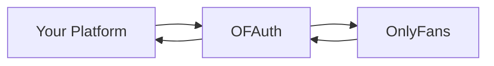
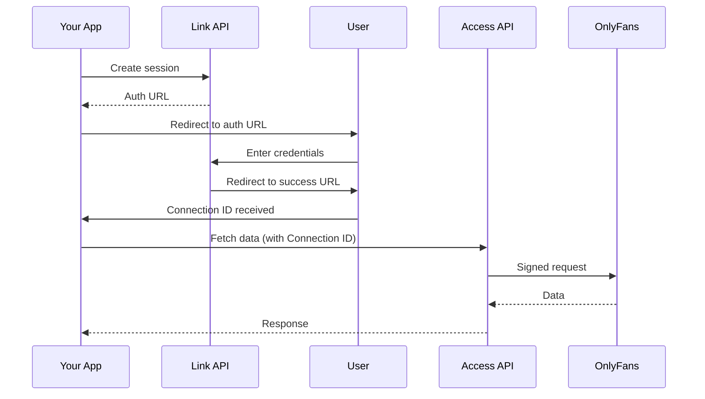

## The Big Picture

OFAuth is **infrastructure for OnlyFans integrations**—like Plaid for banking, but for OnlyFans. We handle authentication, session management, and API complexity so you can focus on building your product.



**You focus on your product. OFAuth handles OnlyFans.**

***

## Why OFAuth Exists

OnlyFans has **no public API**. Building integrations requires:

* **Reverse engineering** authentication flows, request signing, and session management
* **Constant maintenance** as OnlyFans changes their API (sometimes multiple times per day)
* **Security liability** from handling user credentials

OFAuth solves this:

| Challenge                 | OFAuth Solution                                       |
| ------------------------- | ----------------------------------------------------- |
| No public API             | Managed Access API with stable endpoints              |
| Authentication complexity | Link handles login, 2FA, captcha                      |
| Credential security       | Zero credential storage—you only store Connection IDs |
| API changes               | Dynamic Rules engine adapts automatically             |
| Signing requirements      | Request signing handled transparently                 |

<Info>
  Teams report spending 3-6 months building OnlyFans integrations in-house. With OFAuth, you're live in days.
</Info>

***

## Core Concepts

### Connections

A **Connection** represents a linked OnlyFans account. When a user authenticates through OFAuth, you receive a Connection ID that you use to access their data.

<CardGroup cols={2}>
  <Card title="What You Store" icon="database">
    Just the Connection ID (e.g., `conn_abc123`)—a simple string in your database
  </Card>

  <Card title="What OFAuth Handles" icon="shield-check">
    Sessions, credentials, expiration, re-authentication—all the complexity
  </Card>
</CardGroup>

**Think of a Connection ID like an access token**—it represents permission to act on behalf of a user.

***

### Link API

The **Link API** handles user authentication. It's how OnlyFans users connect their accounts to your platform.

<Steps>
  <Step title="Create a Link session">
    Your backend calls OFAuth to get an authentication URL
  </Step>

  <Step title="User authenticates">
    They log into OnlyFans on a secure OFAuth-hosted page
  </Step>

  <Step title="Receive a Connection">
    OFAuth redirects back with a Connection ID you can use
  </Step>
</Steps>

**Link is similar to OAuth**—users see a branded consent flow, enter their credentials on a trusted page, and your app receives a token (the Connection ID) to use.

<Info>
  You never see or handle OnlyFans passwords. Authentication happens entirely on OFAuth's secure pages.
</Info>

***

### Access API

The **Access API** lets you fetch OnlyFans data using a Connection ID. It's a proxy that handles request signing, session management, and API complexity.

```
Your App → Access API → OnlyFans → Access API → Your App
              ↑
     Handles signing, retries,
     rate limits, and errors
```

**Two ways to use it:**

| Method                | Best For                                                                          |
| --------------------- | --------------------------------------------------------------------------------- |
| **Managed Endpoints** | Common operations like fetching profiles, posts, messages—stable, typed responses |
| **Proxy Endpoints**   | Any OnlyFans API path—raw responses for advanced use cases                        |

<Tip>
  Most integrations only use Managed Endpoints. The Proxy is there when you need something specific that isn't covered.
</Tip>

***

### Dynamic Rules (Advanced)

OnlyFans requires cryptographically signed requests. These signing rules **change frequently**—sometimes multiple times per day.

<Warning>
  **Most users don't need Dynamic Rules.** If you're using the Access API or SDK, signing is automatic. Dynamic Rules are only for advanced use cases where you call OnlyFans APIs directly.
</Warning>

| If you're using...    | Do you need Dynamic Rules?         |
| --------------------- | ---------------------------------- |
| Access API            | No—signing is automatic            |
| JavaScript SDK        | No—handled by the SDK              |
| Direct OnlyFans calls | Yes—you need current signing rules |

***

## The Complete Flow

Here's how a typical OFAuth integration works:



1. **Link** creates the connection (one-time per user)
2. **Access** fetches data using that connection (ongoing)

***

## Glossary

| Term              | Definition                                                           |
| ----------------- | -------------------------------------------------------------------- |
| **Connection**    | A linked OnlyFans account, represented by a Connection ID            |
| **Connection ID** | Unique identifier (e.g., `conn_abc123`) used to access a user's data |
| **Link Session**  | Temporary authentication flow—expires after 1 hour                   |
| **API Key**       | Your OFAuth API key for authenticating requests                      |
| **Dynamic Rules** | Current OnlyFans request signing parameters                          |

***

## Next Steps

<CardGroup cols={2}>
  <Card title="2-Minute Quickstart" icon="rocket" href="/quickstart">
    See this in action with working code
  </Card>

  <Card title="Security Model" icon="shield-check" href="/reference/security">
    How we protect credentials and data
  </Card>
</CardGroup>
