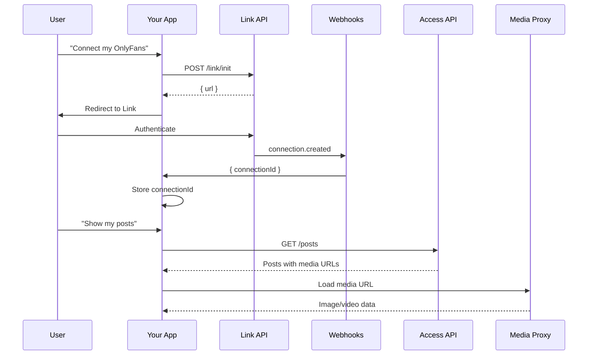

OFAuth is a suite of services that each solve a specific piece of the OnlyFans integration puzzle. This page helps you understand which services you need and how they fit together.

## The Integration Journey

Every OFAuth integration follows the same lifecycle:



1. **Link** authenticates the user and produces a Connection ID
2. **Webhooks** notify you when that connection is ready (or later expires)
3. **Access** uses the Connection ID to read and write OnlyFans data
4. **Media Proxy** provides access to OnlyFans media through proxied URLs

---

## Which Services Do You Need?

| I need to... | Service | Required? |
|---|---|---|
| Connect a user's OnlyFans account | [Link API](#link-api) | Core |
| Read/write OnlyFans data (posts, messages, fans) | [Access API](#access-api) | Core |
| Get notified when connections change | [Webhooks](#webhooks) | Recommended |
| Access OnlyFans media (images, videos) | [Media Proxy](#media-proxy) | Automatic |
| Manage connections and org settings | [Account API](#account-api) | As needed |
| Store media permanently beyond session expiry | [Vault Cache](#vault-cache) | Optional |
| Sign requests for direct OnlyFans API calls | [Dynamic Rules](#dynamic-rules) | Advanced |

<Info>
Most integrations use **Link + Access + Webhooks**. Media Proxy is automatic (URLs in Access responses are already proxied). Everything else is opt-in.
</Info>

---

## Link API

Secure, hosted authentication for OnlyFans accounts. Users enter credentials on OFAuth's pages — you never handle passwords. After authentication, you receive a Connection ID.

| Integration Mode | Best For |
|---|---|
| **Redirect (Hosted)** | Simple setup, server-rendered apps |
| **Popup (Embed)** | Best UX, SPAs — user stays in your app |

<Card title="Link Authentication Guide" icon="key" href="/guides/link">
  Step-by-step integration with redirect and popup modes
</Card>

## Access API

Make OnlyFans API requests using Connection IDs. Handles request signing, proxy routing, and session management so you don't need to build that infrastructure.

| Method | Use When |
|---|---|
| **Managed Endpoints** (`/v2/access/*`) | Common operations — typed responses |
| **Proxy Endpoints** (`/v2/access/proxy/*`) | Any OnlyFans API path we haven't wrapped yet |

<CardGroup cols={2}>
  <Card title="Access Overview" icon="list" href="/api-reference/access/overview">
    Endpoint reference and permissions
  </Card>
  <Card title="Proxy Endpoints" icon="shuffle" href="/api-reference/access/proxy">
    Raw passthrough for advanced use cases
  </Card>
</CardGroup>

## Webhooks

Real-time push notifications when connections are created, updated, or expire. Eliminates polling.

<Card title="Webhooks Reference" icon="webhook" href="/reference/webhooks">
  Event types, payloads, and signature verification
</Card>

## Media Proxy

OnlyFans media cannot be accessed directly — CDN URLs are signed, short-lived, and block cross-origin requests. Media Proxy transforms them into stable `media.ofauth.com` URLs with extended validity, CORS headers, and global edge caching. This happens automatically — URLs in Access API responses are already proxied.

```html

```

<Note>
Bandwidth is billed per KB transferred. Cache hits (within 7 days) are free.
</Note>

## Account API

Administrative interface for managing your organization, connections, and settings. Use it to verify your API key, list connected accounts, or disconnect users.

<Card title="Account API Reference" icon="building" href="/api-reference/core/overview">
  Complete endpoint documentation
</Card>

## Vault Cache

Persistent media storage that survives session expiry. Unlike Media Proxy (temporary edge caching), Vault Cache stores media permanently and serves it by ID.

<Card title="Media Storage Guide" icon="database" href="/guides/media-storage">
  Media Proxy vs Vault Cache — when to use which
</Card>

## Dynamic Rules

Request signing parameters for direct OnlyFans API calls. Signing rules change frequently — sometimes multiple times per day.

<Warning>
Most integrations don't need this. If you use the Access API, signing is handled automatically.
</Warning>

<Card title="Dynamic Rules Reference" icon="wand-magic-sparkles" href="/api-reference/dynamic-rules/overview">
  Complete endpoint documentation
</Card>

---

## Next Steps

<CardGroup cols={2}>
  <Card title="Quickstart" icon="rocket" href="/quickstart">
    Get your first API call working
  </Card>
  <Card title="How OFAuth Works" icon="lightbulb" href="/introduction/how-it-works">
    Core concepts and architecture
  </Card>
  <Card title="Integration Checklist" icon="check" href="/setup/integration-checklist">
    Production readiness guide
  </Card>
  <Card title="TypeScript SDK" icon="code" href="/sdk">
    Type-safe development experience
  </Card>
</CardGroup>
