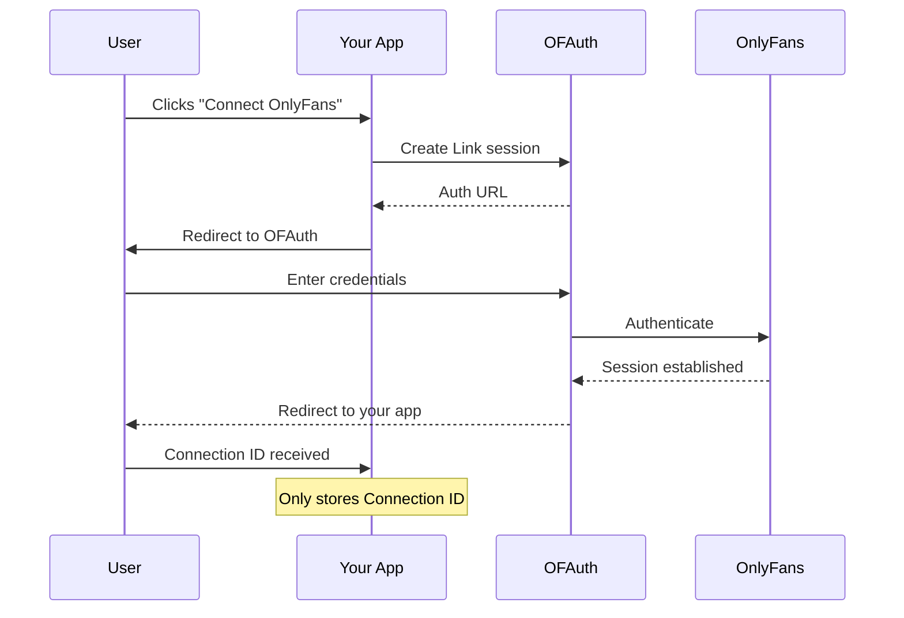

## Security Architecture

OFAuth is designed with a **zero-credential storage architecture**—neither your servers nor OFAuth ever store OnlyFans credentials. Credentials are used once during authentication and immediately discarded.

---

## Credential Handling

<CardGroup cols={2}>
  <Card title="Your Servers" icon="server">
    **Only store Connection IDs**—simple string tokens like `conn_abc123`. No credentials, no session data.
  </Card>
  <Card title="OFAuth Infrastructure" icon="shield-check">
    **Zero credential storage**. Credentials are used once to establish a session, then immediately discarded. Only active session tokens are stored encrypted.
  </Card>
</CardGroup>

### What You Store vs What OFAuth Stores

| Data | Your Servers | OFAuth |
|------|--------------|--------|
| Connection ID | ✅ | ✅ |
| OnlyFans credentials | ❌ Never | ❌ Never stored |
| Session tokens | ❌ Never | ✅ Encrypted (active sessions only) |
| User content/data | Your choice | ❌ Not stored |

<Tip>
  **Compliance benefit**: Neither you nor OFAuth store credentials. OFAuth only maintains encrypted session tokens for active connections, minimizing security exposure.
</Tip>

---

## Encryption Standards

All data in OFAuth is protected with industry-standard encryption:

- **In transit**: TLS 1.3 for all API communications
- **At rest**: AES-256 encryption for session tokens
- **Key management**: Keys rotated regularly, stored in hardware security modules (HSMs)

---

## Data Flow

OFAuth operates as a **transparent proxy**. We don't store OnlyFans content data:

<Steps>
  <Step title="Request from your app">
    Your server sends a request to OFAuth with a Connection ID
  </Step>
  <Step title="OFAuth signs and forwards">
    We sign the request using the connection's session and forward to OnlyFans
  </Step>
  <Step title="Response returned">
    OnlyFans response is returned directly to you—we don't store content
  </Step>
</Steps>

<Info>
  **What OFAuth stores**: Connection metadata (status, timestamps), encrypted session data, and usage metrics for billing. **What OFAuth doesn't store**: OnlyFans content, messages, media, or user data.
</Info>

---

## Infrastructure Security

<CardGroup cols={2}>
  <Card title="Cloud Infrastructure" icon="cloud">
    Hosted on enterprise cloud providers with SOC 2 Type II certification
  </Card>
  <Card title="Network Security" icon="network-wired">
    All traffic encrypted, DDoS protection, WAF-protected endpoints
  </Card>
  <Card title="Access Controls" icon="lock">
    Role-based access, MFA required, audit logging for all operations
  </Card>
  <Card title="Monitoring" icon="chart-line">
    24/7 monitoring, automated alerting, incident response procedures
  </Card>
</CardGroup>

---

## Session Management

OFAuth automatically manages OnlyFans session lifecycle:

| Event | OFAuth Action | Your Action |
|-------|---------------|-------------|
| Session expires | Attempts automatic refresh | None required |
| Refresh fails | Marks connection as expired | Re-authenticate user via Link |
| 2FA required | Notifies via webhook | Prompt user to re-authenticate |

<Tip>
  Set up webhooks to get notified when connections need re-authentication. This lets you proactively reach out to users before their integration stops working.
</Tip>

---

## Compliance Considerations

Using OFAuth simplifies your compliance posture:

<AccordionGroup>
  <Accordion title="SOC 2">
    OFAuth infrastructure is hosted on SOC 2 Type II certified cloud providers. Contact us for detailed security documentation.
  </Accordion>
  <Accordion title="GDPR">
    OFAuth processes data as a data processor on your behalf. We provide DPAs upon request and support data deletion requests.
  </Accordion>
  <Accordion title="Data Residency">
    Contact us for information about data residency options for enterprise deployments.
  </Accordion>
</AccordionGroup>

---

## Security Contact

For security concerns or to report vulnerabilities:

<Card title="Security Team" icon="shield" href="mailto:security@ofauth.com">
  security@ofauth.com
</Card>

