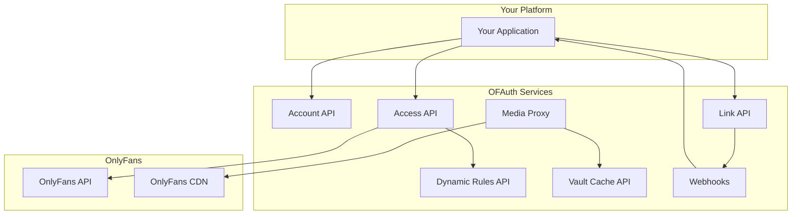

OFAuth provides a suite of interconnected services that handle OnlyFans integration complexity. This page explains each service, its purpose, and how they interact.

## Service Overview



---

## Account API

**Purpose:** Manage your OFAuth account and connections.

The Account API is your administrative interface to OFAuth. Use it to verify your API key works, list all connected accounts, and manage connection lifecycle.

### Base URL

```
https://api.ofauth.com/v2/account
```

### Key Endpoints

| Endpoint | Method | Description |
|----------|--------|-------------|
| `/account/whoami` | GET | Get your organization info and verify API key |
| `/account/settings` | GET/PATCH | Organization-level settings |
| `/account/connections` | GET | List all connections for your account |
| `/account/connections/{connectionId}` | DELETE | Disconnect an account |
| `/account/connections/{connectionId}/invalidate` | POST | Force session expiration |
| `/account/connections/{connectionId}/settings` | GET/PATCH | Per-connection settings |

### Authentication

```http
apikey: YOUR_API_KEY
```

### When to Use

- Verify your API key on startup
- Build admin dashboards showing connected accounts
- Implement "disconnect" functionality for users
- Configure organization or connection settings

<Card title="Account API Reference" icon="building" href="/api-reference/account/overview">
  Complete endpoint documentation
</Card>

---

## Link API

**Purpose:** Authenticate OnlyFans users and create connections.

The Link API provides secure, hosted authentication flows. Users enter their OnlyFans credentials on OFAuth's pages—you never handle passwords. After authentication, you receive a Connection ID to use with the Access API.

### Base URL

```
https://api.ofauth.com/v2/link
```

### Key Endpoints

| Endpoint | Method | Description |
|----------|--------|-------------|
| `/link/init` | POST | Create a new authentication session |
| `/link/{clientSecret}` | GET | Check session status |
| `/link/{clientSecret}` | DELETE | Cancel a session |

### Authentication

```http
apikey: YOUR_API_KEY
```

### Flow Overview

```mermaid
sequenceDiagram
    participant App as Your App
    participant Link as Link API
    participant User
    
    App->>Link: POST /link/init
    Link-->>App: { url, expiresAt }
    App->>User: Redirect to URL
    User->>Link: Enter credentials
    Note over Link: Handles 2FA, captcha
    Link->>User: Redirect to callback
    User->>App: ?connection_id=conn_xxx
```

### Integration Options

| Mode | Description | Best For |
|------|-------------|----------|
| **Redirect (Hosted)** | Full-page redirect to OFAuth | Simple setup, server-rendered apps |
| **Popup (Embed)** | Popup window, user stays in your app | Best UX, SPAs |

### When to Use

- Onboard new users to connect their OnlyFans accounts
- Re-authenticate expired connections
- Reconnect with different permissions

<Card title="Link Authentication Guide" icon="key" href="/guides/link">
  Integration options and step-by-step tutorial
</Card>

---

## Access API

**Purpose:** Read and write OnlyFans data using connection IDs.

The Access API is your primary interface for OnlyFans operations. It handles request signing, session management, rate limiting, and error recovery automatically. All you need is a valid Connection ID.

### Base URL

```
https://api.ofauth.com/v2/access
```

### Two Types of Endpoints

| Type | Path | Description |
|------|------|-------------|
| **Managed** | `/v2/access/*` | Stable, typed endpoints for common operations |
| **Proxy** | `/v2/access/proxy/*` | Raw passthrough to any OnlyFans API path |

### Managed Endpoint Categories

| Category | Examples |
|----------|----------|
| **Account** | `/self`, `/self/notifications` |
| **Users** | `/users/{id}`, `/users/lists` |
| **Subscribers** | `/subscribers`, `/subscribers/{id}/note` |
| **Posts** | `/posts`, `/posts/{id}` |
| **Messages** | `/chats`, `/chats/{userId}/messages` |
| **Mass Messages** | `/mass-messages` |
| **Vault** | `/vault/media`, `/vault/lists` |
| **Uploads** | `/uploads/init`, `/uploads/complete` |
| **Statistics** | `/statistics/earnings/chart`, `/statistics/posts/top` |
| **Promotions** | `/promotions`, `/promotions/tracking-links` |

### Authentication

```http
apikey: YOUR_API_KEY
x-connection-id: conn_abc123
```

### When to Use

- Fetch user profiles, posts, subscribers
- Send messages (direct and mass)
- Create and manage content
- Upload media to vault
- Retrieve earnings and analytics
- Manage promotions and campaigns

<CardGroup cols={2}>
  <Card title="Managed Endpoints" icon="list" href="/api-reference/access/managed">
    Complete managed endpoint reference
  </Card>
  <Card title="Proxy Endpoints" icon="shuffle" href="/api-reference/access/proxy">
    Raw passthrough documentation
  </Card>
</CardGroup>

---

## Dynamic Rules API

**Purpose:** Generate request signatures for direct OnlyFans API calls.

OnlyFans requires cryptographic signatures on every request. These signing rules change frequently—sometimes multiple times per day. The Dynamic Rules API provides current signing parameters and can sign requests on demand.

<Warning>
  **Most integrations don't need this.** If you use the Access API or SDK, signing is automatic. Dynamic Rules is only for advanced use cases where you call OnlyFans directly.
</Warning>

### Base URL

```
https://api.ofauth.com/v2/dynamic-rules
```

### Key Endpoints

| Endpoint | Method | Description |
|----------|--------|-------------|
| `/dynamic-rules` | GET | Get current signing rules |
| `/dynamic-rules/sign` | POST | Sign a specific request |
| `/dynamic-rules/status` | GET | Check if rules are current |

### Authentication

```http
apikey: YOUR_API_KEY
```

### When to Use

- Building a custom OnlyFans proxy
- Advanced integrations requiring direct API access
- Debugging request signing issues

<Card title="Dynamic Rules Reference" icon="wand-magic-sparkles" href="/api-reference/dynamic-rules/overview">
  Complete endpoint documentation
</Card>

---

## Media Proxy

**Purpose:** Serve OnlyFans media with extended validity and CORS support.

OnlyFans CDN URLs expire quickly and block cross-origin requests. The Media Proxy transforms these into `media.ofauth.com` URLs that work in browsers, have extended validity, and are globally edge-cached.

### How It Works

```
Original:  https://cdn.onlyfans.com/signed/abc123?expires=...
Proxied:   https://media.ofauth.com/v1/abc123...
```

When you fetch data from the Access API, all media URLs are automatically transformed to proxied URLs.

### Features

| Feature | Description |
|---------|-------------|
| **Extended validity** | URLs last longer than OnlyFans CDN links |
| **CORS enabled** | Embeddable in ``, `<video>` tags |
| **Edge cached** | Fast global delivery, cache hits are free |
| **Auto-transform** | Access API responses include proxied URLs |

### Usage

```html
<!-- Just use the URL from API responses -->

<video src="https://media.ofauth.com/v1/xyz789/video.mp4" controls />
```

### Billing

- Bandwidth is billed per KB transferred
- Cache hits (within 7 days) are free
- Monitor usage in your dashboard

<Card title="Media Storage Guide" icon="photo-film" href="/guides/media-storage">
  Media Proxy vs Vault Cache comparison
</Card>

---

## Vault Cache API

**Purpose:** Persistent media storage with direct access by ID.

While Media Proxy is temporary edge caching, Vault Cache provides permanent storage. Cache media by ID and retrieve it anytime—even if the original OnlyFans URL has expired.

### Base URL

```
https://api.ofauth.com/v2/vault
```

### Key Endpoints

| Endpoint | Method | Description |
|----------|--------|-------------|
| `/vault/{mediaId}` | GET | Get cached media URL by ID |
| `/vault/urls` | POST | Batch get URLs (up to 100) |
| `/vault/list` | GET | List all cached media |
| `/vault/{mediaId}` | DELETE | Remove from cache |
| `/vault/purge` | DELETE | Purge all cached media |
| `/vault/cache/list/{listId}` | POST | Cache entire vault list |
| `/vault/cache/status` | GET | Get cache status |
| `/vault/cache/stats` | GET | Get cache statistics |

### Authentication

```http
apikey: YOUR_API_KEY
x-connection-id: conn_abc123
```

### Triggering Caching

```bash
# Via Media Proxy URL (POST to trigger cache)
curl -X POST 'https://media.ofauth.com/abc123...'

# Via API (cache entire vault list)
curl -X POST 'https://api.ofauth.com/v2/vault/cache/list/:listId' \
  -H 'apikey: YOUR_API_KEY' \
  -H 'x-connection-id: conn_xxx'
```

### When to Use

- Build media libraries that persist beyond session expiry
- PPV content that needs reliable access
- Backup/archive features
- Offline-capable applications

<Card title="Media Storage Guide" icon="database" href="/guides/media-storage">
  Complete guide on Media Proxy vs Vault Cache
</Card>

---

## Webhooks

**Purpose:** Real-time notifications for connection and system events.

Webhooks push events to your server when connections change state. No polling required—you're notified immediately when something happens.

### Configuration

Configure webhooks in the [OFAuth Dashboard](https://app.ofauth.com/platform/developers/webhooks):
- Set your endpoint URL (HTTPS required)
- Select events to subscribe to
- Get your signing secret for verification

### Event Types

| Event | Trigger |
|-------|---------|
| `connection.created` | New connection established |
| `connection.updated` | Connection details changed |
| `connection.expired` | Session expired or invalidated |
| `rules.updated` | Dynamic rules changed |

### Payload Example

```json
{
  "type": "connection.created",
  "timestamp": "2024-01-15T10:30:00Z",
  "data": {
    "clientReferenceId": "user_456",
    "connection": {
      "id": "conn_abc123",
      "status": "active",
      "permissions": ["profile:read", "posts:read"],
      "userData": {
        "id": "of_user_456",
        "name": "Jane Doe",
        "username": "janedoe"
      }
    }
  }
}
```

### When to Use

- Store Connection IDs when users complete authentication
- Update your database when connections expire
- Trigger re-authentication flows
- Monitor Dynamic Rules changes (advanced)

<Card title="Webhooks Reference" icon="webhook" href="/reference/webhooks">
  Event types, payloads, and verification
</Card>

---

## How Services Work Together

### Typical Integration Flow

```mermaid
sequenceDiagram
    participant User
    participant App as Your App
    participant Link as Link API
    participant Webhook as Webhooks
    participant Access as Access API
    participant Media as Media Proxy
    
    User->>App: "Connect my OnlyFans"
    App->>Link: POST /link/init
    Link-->>App: { url }
    App->>User: Redirect to Link
    User->>Link: Authenticate
    Link->>Webhook: connection.created
    Webhook->>App: { connectionId }
    App->>App: Store connectionId
    
    User->>App: "Show my posts"
    App->>Access: GET /posts
    Access-->>App: Posts with media URLs
    App->>Media: 
    Media-->>App: Image data
```

### Service Dependencies

| Service | Depends On | Provides To |
|---------|------------|-------------|
| **Link** | Account (API key) | Access (Connection IDs), Webhooks |
| **Access** | Account, Link (Connection IDs), Dynamic Rules (signing) | Your app, Media Proxy |
| **Media Proxy** | Access (URLs in responses) | Your app, Vault Cache |
| **Vault Cache** | Media Proxy (triggers), Access | Your app |
| **Dynamic Rules** | Account | Access (automatic), Your app (advanced) |
| **Webhooks** | Link, Account | Your app |

---

## Choosing the Right Service

| I want to... | Use |
|--------------|-----|
| Verify my API key works | Account API `/account/whoami` |
| Connect a user's OnlyFans | Link API |
| Fetch user data, posts, messages | Access API (managed) |
| Access an undocumented OnlyFans endpoint | Access API (proxy) |
| Display media in my app | Media Proxy URLs (automatic) |
| Store media permanently | Vault Cache API |
| Get notified when connections change | Webhooks |
| Sign requests for direct OnlyFans calls | Dynamic Rules API |

---

## Next Steps

<CardGroup cols={2}>
  <Card title="Quickstart" icon="rocket" href="/quickstart">
    Get your first API call working
  </Card>
  <Card title="How OFAuth Works" icon="lightbulb" href="/overview/how-it-works">
    Conceptual overview
  </Card>
  <Card title="Integration Checklist" icon="check" href="/getting-started/integration-checklist">
    Production readiness guide
  </Card>
  <Card title="TypeScript SDK" icon="code" href="/sdk">
    Simplified development experience
  </Card>
</CardGroup>
