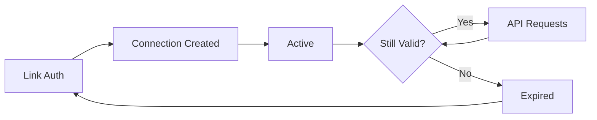

The Connections API manages your connected OnlyFans accounts. Connections are created through [Link](/guides/how-to/connect-account) and used with the [Access API](/reference/access).

## Connection States

| State | Description |
|-------|-------------|
| `pending` | Authentication in progress |
| `active` | Ready for API access |
| `awaiting_2fa` | Waiting for 2FA verification |
| `expired` | Session ended, re-authentication needed |
| `failed` | Authentication failed |

## Connection Lifecycle



Connections may expire due to:
- OnlyFans session expiration
- User password changes
- Extended inactivity

<Tip>
Set up [webhooks](/reference/webhooks) to receive `connection.expired` events.
</Tip>

## API Reference

### List Connections

```http
GET /v2/connections
```

| Parameter | Type | Description |
|-----------|------|-------------|
| `limit` | integer | Max results (default: 10) |
| `offset` | integer | Skip count (default: 0) |
| `status` | string | Filter: `active`, `expired`, `awaiting_2fa` |

### Delete Connection

```http
DELETE /v2/connections/{connectionId}
```

<Warning>
Deleting a connection logs the user out and stops billing.
</Warning>

## Best Practices

- **Monitor status** via webhooks
- **Handle expiration** with re-auth flows
- **Store securely** - treat connection IDs as credentials
- **Clean up** unused connections to stop billing

## Next Steps

<CardGroup cols={2}>
  <Card title="Access API" icon="key" href="/reference/access">
    Use connections to access data
  </Card>
  <Card title="Webhooks" icon="bell" href="/reference/webhooks">
    Monitor connection events
  </Card>
</CardGroup>

