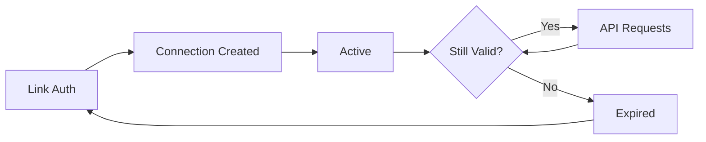

The Connections API manages your connected OnlyFans accounts. Connections are created through [Link](/guides/how-to/connect-account) and used with the [Access API](/reference/access).

## Obtaining Connection IDs

After a user completes authentication through Link, you receive the connection ID through one of these methods:

| Method | When to Use |
|--------|-------------|
| [`connection.created` webhook](/reference/webhooks) | **Recommended.** Server-side, reliable, includes full details |
| [Embed `onSuccess` callback](/guides/link/embed#event-data-types) | Client-side, immediate feedback for embedded flows |
| [Redirect query params](/guides/link/hosted#redirect-query-parameters) | Hosted redirect flow, `connection_id` in URL |

### Using Client Reference ID

The `clientReferenceId` you provide when [initializing a Link session](/api-reference/link/init) is your key to mapping connections to users in your system:

```javascript
// 1. When initializing Link, pass your internal user ID
const session = await fetch("https://api.ofauth.com/v2/link/init", {
  method: "POST",
  headers: { apikey: "YOUR_API_KEY", "Content-Type": "application/json" },
  body: JSON.stringify({
    redirectUrl: "https://yourapp.com/callback",
    clientReferenceId: "user_abc123" // Your internal user ID
  })
});
```

```javascript
// 2. In webhook handler, use clientReferenceId to store the connection
app.post("/webhooks/ofauth", async (req, res) => {
  const { type, data } = req.body;
  
  if (type === "connection.created") {
    // Use clientReferenceId to find your user and store their connection
    await db.users.update({
      where: { id: data.clientReferenceId },
      data: { connectionId: data.connection.id }
    });
  }
  
  res.status(200).send("ok");
});
```

<Tip>
Always pass a `clientReferenceId` when initializing Link sessions. This is the recommended way to correlate connections back to your users, especially when using webhooks.
</Tip>

## Connection States

| State | Description |
|-------|-------------|
| `pending` | Authentication in progress |
| `active` | Ready for API access |
| `awaiting_2fa` | Waiting for 2FA verification |
| `expired` | Session ended, re-authentication needed |
| `failed` | Authentication failed |

## Connection Lifecycle



Connections may expire due to:
- OnlyFans session expiration
- User password changes
- Extended inactivity

<Tip>
Set up [webhooks](/reference/webhooks) to receive `connection.expired` events.
</Tip>

## API Reference

### List Connections

```http
GET /v2/connections
```

| Parameter | Type | Description |
|-----------|------|-------------|
| `limit` | integer | Max results (default: 10) |
| `offset` | integer | Skip count (default: 0) |
| `status` | string | Filter: `active`, `expired`, `awaiting_2fa` |

### Delete Connection

```http
DELETE /v2/connections/{connectionId}
```

<Warning>
Deleting a connection logs the user out and stops billing.
</Warning>

## Reconnecting Expired Connections

When a connection expires, you can reconnect the same OnlyFans account without creating a duplicate connection. Pass the existing `connectionId` when initializing a new Link session:

```bash
curl -X POST https://api.ofauth.com/v2/link/init \
  -H "Authorization: Bearer YOUR_API_KEY" \
  -H "Content-Type: application/json" \
  -d '{
    "connectionId": "conn_abc123xyz",
    "redirectUrl": "https://yourapp.com/callback"
  }'
```

| Parameter | Type | Description |
|-----------|------|-------------|
| `connectionId` | string | Existing connection ID to reconnect. Must start with `conn_`. |

When a valid `connectionId` is provided:
- The user completes authentication through Link
- The existing connection is **updated** with fresh session data
- Connection ID remains the same, preserving your references

When an invalid or non-existent `connectionId` is provided:
- The system automatically creates a new connection instead
- No error is thrown—this allows graceful handling of deleted connections

<Tip>
Use reconnection for expired connections to maintain consistent connection IDs in your database and avoid duplicate records.
</Tip>

## Best Practices

- **Monitor status** via webhooks
- **Handle expiration** with re-auth flows using `connectionId`
- **Store securely** - treat connection IDs as credentials
- **Clean up** unused connections to stop billing

## Next Steps

<CardGroup cols={2}>
  <Card title="Access API" icon="key" href="/reference/access">
    Use connections to access data
  </Card>
  <Card title="Webhooks" icon="bell" href="/reference/webhooks">
    Monitor connection events
  </Card>
</CardGroup>

