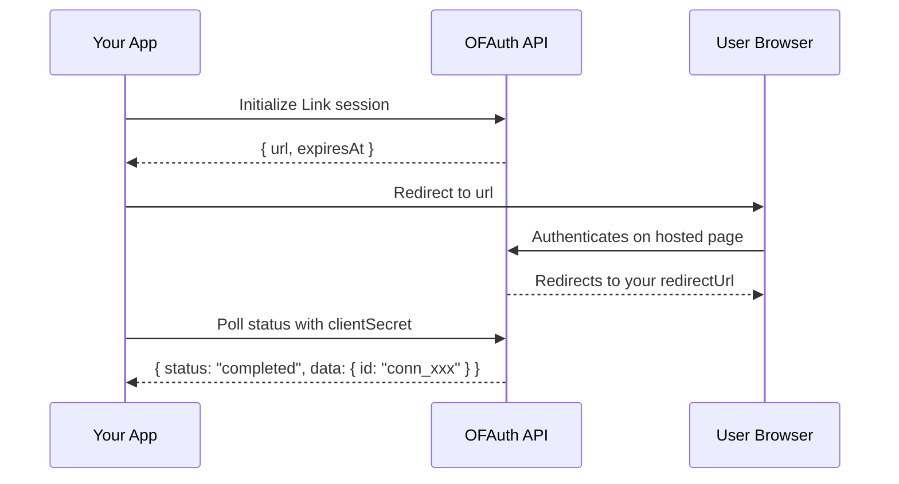

## Overview

Link is OFAuth's hosted authentication flow. You initialize a session, redirect the user to authenticate on OFAuth's secure page, then poll for the result. When authentication completes, you receive a **connection ID** that you use for all subsequent API calls.

<Info>
  The Link flow handles credentials, 2FA, and session management on OFAuth's side. Your application never touches OnlyFans passwords.
</Info>

## Complete Link Flow



## Initialize a Link Session

Create a Link session and redirect the user to the returned URL.

```csharp
using OFAuth;

var client = new OFAuthClient("your-api-key");

try
{
    var session = await client.PostAsync<LinkInitResponse>(
        "/v2/link/init",
        body: new { redirectUrl = "https://yourapp.com/callback" }
    );

    Console.WriteLine($"Redirect user to: {session.Url}");
    Console.WriteLine($"Expires at: {session.ExpiresAt}");
}
catch (OFAuthException ex)
{
    Console.WriteLine($"Error: {ex.Status} {ex.Message}");
}
```

### Init Options

| Parameter | Type | Description |
| --- | --- | --- |
| `redirectUrl` | `string` | URL to redirect the user to after authentication |
| `clientReferenceId` | `string` | Your own reference ID to track this session |
| `connectionId` | `string` | Existing connection ID for re-authentication |

## Poll Link Status

After the user authenticates, poll the Link session to check if it completed. The response includes the status and, when completed, the connection data.

```csharp
var status = await client.GetAsync<LinkStatusResponse>("/v2/link/cs_xxx");

Console.WriteLine($"Status: {status.Status}");

if (status.Status == "completed" && status.Data != null)
{
    Console.WriteLine($"Connection ID: {status.Data.Id}");
    Console.WriteLine($"Username: {status.Data.UserData.Username}");
}
```

### Status Values

| Status | Meaning |
| --- | --- |
| `initialized` | Session created, user hasn't started yet |
| `pending` | User is in the authentication process |
| `awaiting_2fa` | Waiting for 2FA verification |
| `completed` | Authentication successful — connection ID available |
| `denied` | User denied access |
| `invalid_credentials` | Credentials were incorrect |
| `failed` | Authentication failed |
| `not_found` | Session not found or expired |

## Delete a Link Session

Cancel a Link session that is no longer needed:

```csharp
await client.DeleteAsync<object>("/v2/link/cs_xxx");
```

## Complete Polling Example

In production, you'll typically poll the Link status in a loop until authentication completes or fails. See the TypeScript or Python SDK docs for a complete polling example pattern — the C# equivalent uses `Task.Delay` for the poll interval and a `while` loop with status checks.

<Warning>
  **Use Sandbox for testing!** Before testing with real OnlyFans accounts, use the [Sandbox environment](/setup/sandbox) with test credentials. Too many login attempts on production accounts can trigger OnlyFans "suspicious activity" detection.
</Warning>

## Next Steps

<CardGroup cols={2}>
  <Card title="Connection Management" icon="link" href="/sdk/csharp/modules/authentication/link-connections">
    Manage, monitor, and import connections
  </Card>
  <Card title="Webhooks" icon="webhook" href="/reference/webhooks">
    Get notified when connections change status
  </Card>
</CardGroup>
