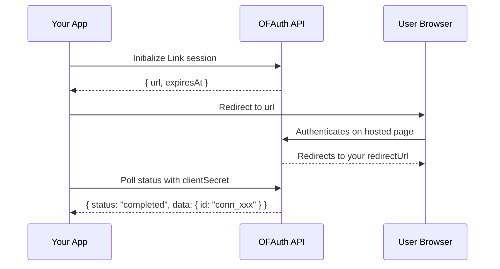

## Overview

Link is OFAuth's hosted authentication flow. You initialize a session, redirect the user to authenticate on OFAuth's secure page, then poll for the result. When authentication completes, you receive a **connection ID** that you use for all subsequent API calls.

<Info>
  The Link flow handles credentials, 2FA, and session management on OFAuth's side. Your application never touches OnlyFans passwords.
</Info>

## Complete Link Flow



## Initialize a Link Session

Create a Link session and redirect the user to the returned URL.

```go
ctx := context.Background()
client := ofauth.NewClient("your-api-key")

redirectUrl := "https://yourapp.com/callback"
session, err := client.LinkInit(ctx, struct {
    RedirectUrl       *string `json:"redirectUrl,omitempty"`
    ClientReferenceId *string `json:"clientReferenceId,omitempty"`
    ConnectionId      *string `json:"connectionId,omitempty"`
    Geolocation       *struct {
        Country string  `json:"country"`
        State   *string `json:"state,omitempty"`
        City    *string `json:"city,omitempty"`
    } `json:"geolocation,omitempty"`
}{
    RedirectUrl: &redirectUrl,
})
if err != nil {
    log.Fatal(err)
}

fmt.Println("Redirect user to:", session.Url)
fmt.Println("Expires at:", session.ExpiresAt)
```

### Init Options

| Parameter | Type | Description |
| --- | --- | --- |
| `redirectUrl` | `string` | URL to redirect the user to after authentication |
| `clientReferenceId` | `string` | Your own reference ID to track this session |
| `connectionId` | `string` | Existing connection ID for re-authentication |

## Poll Link Status

After the user authenticates, poll the Link session to check if it completed. The response includes the status and, when completed, the connection data.

```go
status, err := client.GetLink(ctx, "cs_xxx")
if err != nil {
    log.Fatal(err)
}

fmt.Println("Status:", status.Status)

if status.Status == "completed" && status.Data != nil {
    fmt.Println("Connection ID:", status.Data.Id)
}
```

### Status Values

| Status | Meaning |
| --- | --- |
| `initialized` | Session created, user hasn't started yet |
| `pending` | User is in the authentication process |
| `awaiting_2fa` | Waiting for 2FA verification |
| `completed` | Authentication successful — connection ID available |
| `denied` | User denied access |
| `invalid_credentials` | Credentials were incorrect |
| `failed` | Authentication failed |
| `not_found` | Session not found or expired |

## Delete a Link Session

Cancel a Link session that is no longer needed:

```go
_, err := client.DeleteLink(ctx, "cs_xxx")
if err != nil {
    log.Fatal(err)
}
```

## Complete Polling Example

In production, you'll typically poll the Link status in a loop until authentication completes or fails:

<Note>
  The Go SDK does not include a built-in polling helper. Use a loop with `time.Sleep` for polling.
</Note>

<Warning>
  **Use Sandbox for testing!** Before testing with real OnlyFans accounts, use the [Sandbox environment](/setup/sandbox) with test credentials. Too many login attempts on production accounts can trigger OnlyFans "suspicious activity" detection.
</Warning>

## Next Steps

<CardGroup cols={2}>
  <Card title="Connection Management" icon="link" href="/sdk/go/modules/authentication/link-connections">
    Manage, monitor, and import connections
  </Card>
  <Card title="Webhooks" icon="webhook" href="/reference/webhooks">
    Get notified when connections change status
  </Card>
</CardGroup>
