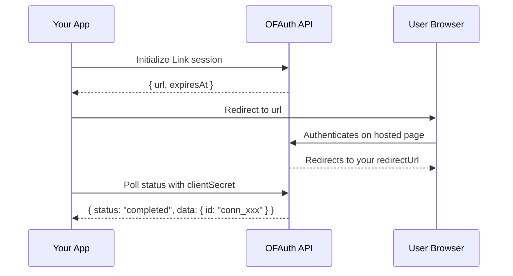

## Overview

Link is OFAuth's hosted authentication flow. You initialize a session, redirect the user to authenticate on OFAuth's secure page, then poll for the result. When authentication completes, you receive a **connection ID** that you use for all subsequent API calls.

<Info>
  The Link flow handles credentials, 2FA, and session management on OFAuth's side. Your application never touches OnlyFans passwords.
</Info>

## Complete Link Flow



## Initialize a Link Session

Create a Link session and redirect the user to the returned URL.

<CodeGroup>
```typescript TypeScript
import { createOFAuthClient } from '@ofauth/onlyfans-sdk';

const client = createOFAuthClient({ apiKey: 'your-api-key' });

try {
  const session = await client.link.init({
    body: {
      redirectUrl: 'https://yourapp.com/callback',
    },
  });

  console.log('Redirect user to:', session.url);
  console.log('Expires at:', session.expiresAt);
} catch (error) {
  console.error('Failed to initialize Link:', error);
}
```

```python Python
from onlyfans_sdk import OFAuthClient, link

client = OFAuthClient(api_key="your-api-key")

try:
    session = link.init_v2_link(client, body={
        "redirectUrl": "https://yourapp.com/callback",
    })

    print("Redirect user to:", session["url"])
    print("Expires at:", session["expiresAt"])
except Exception as e:
    print("Failed to initialize Link:", e)
```

```go Go
ctx := context.Background()
client := ofauth.NewClient("your-api-key")

redirectUrl := "https://yourapp.com/callback"
session, err := client.LinkInit(ctx, struct {
    RedirectUrl       *string `json:"redirectUrl,omitempty"`
    ClientReferenceId *string `json:"clientReferenceId,omitempty"`
    ConnectionId      *string `json:"connectionId,omitempty"`
    Geolocation       *struct {
        Country string  `json:"country"`
        State   *string `json:"state,omitempty"`
        City    *string `json:"city,omitempty"`
    } `json:"geolocation,omitempty"`
}{
    RedirectUrl: &redirectUrl,
})
if err != nil {
    log.Fatal(err)
}

fmt.Println("Redirect user to:", session.Url)
fmt.Println("Expires at:", session.ExpiresAt)
```

```csharp C#
using OFAuth;

var client = new OFAuthClient("your-api-key");

try
{
    var session = await client.PostAsync<LinkInitResponse>(
        "/v2/link/init",
        body: new { redirectUrl = "https://yourapp.com/callback" }
    );

    Console.WriteLine($"Redirect user to: {session.Url}");
    Console.WriteLine($"Expires at: {session.ExpiresAt}");
}
catch (OFAuthException ex)
{
    Console.WriteLine($"Error: {ex.Status} {ex.Message}");
}
```
</CodeGroup>

### Init Options

| Parameter | Type | Description |
| --- | --- | --- |
| `redirectUrl` | `string` | URL to redirect the user to after authentication |
| `clientReferenceId` | `string` | Your own reference ID to track this session |
| `connectionId` | `string` | Existing connection ID for re-authentication |

## Poll Link Status

After the user authenticates, poll the Link session to check if it completed. The response includes the status and, when completed, the connection data.

<CodeGroup>
```typescript TypeScript
const status = await client.link.get({
  clientSecret: 'cs_xxx',
});

console.log('Status:', status.status);
// "initialized" | "pending" | "awaiting_2fa" | "completed" | "denied" | "failed"

if (status.status === 'completed' && status.data) {
  console.log('Connection ID:', status.data.id);
  console.log('Username:', status.data.userData.username);
}
```

```python Python
status = link.get_v2_link(client, client_secret="cs_xxx")

print("Status:", status["status"])

if status["status"] == "completed" and "data" in status:
    print("Connection ID:", status["data"]["id"])
    print("Username:", status["data"]["userData"]["username"])
```

```go Go
status, err := client.GetLink(ctx, "cs_xxx")
if err != nil {
    log.Fatal(err)
}

fmt.Println("Status:", status.Status)

if status.Status == "completed" && status.Data != nil {
    fmt.Println("Connection ID:", status.Data.Id)
}
```

```csharp C#
var status = await client.GetAsync<LinkStatusResponse>("/v2/link/cs_xxx");

Console.WriteLine($"Status: {status.Status}");

if (status.Status == "completed" && status.Data != null)
{
    Console.WriteLine($"Connection ID: {status.Data.Id}");
    Console.WriteLine($"Username: {status.Data.UserData.Username}");
}
```
</CodeGroup>

### Status Values

| Status | Meaning |
| --- | --- |
| `initialized` | Session created, user hasn't started yet |
| `pending` | User is in the authentication process |
| `awaiting_2fa` | Waiting for 2FA verification |
| `completed` | Authentication successful — connection ID available |
| `denied` | User denied access |
| `invalid_credentials` | Credentials were incorrect |
| `failed` | Authentication failed |
| `not_found` | Session not found or expired |

## Delete a Link Session

Cancel a Link session that is no longer needed:

<CodeGroup>
```typescript TypeScript
await client.link.delete({ clientSecret: 'cs_xxx' });
```

```python Python
link.delete_v2_link(client, client_secret="cs_xxx")
```

```go Go
_, err := client.DeleteLink(ctx, "cs_xxx")
if err != nil {
    log.Fatal(err)
}
```

```csharp C#
await client.DeleteAsync<object>("/v2/link/cs_xxx");
```
</CodeGroup>

## Complete Polling Example

In production, you'll typically poll the Link status in a loop until authentication completes or fails:

<CodeGroup>
```typescript TypeScript
import { createOFAuthClient, OFAuthAPIError } from '@ofauth/onlyfans-sdk';

const client = createOFAuthClient({ apiKey: 'your-api-key' });

async function waitForAuthentication(clientSecret: string): Promise<string> {
  const maxAttempts = 60;
  const pollInterval = 3000; // 3 seconds

  for (let i = 0; i < maxAttempts; i++) {
    const status = await client.link.get({ clientSecret });

    switch (status.status) {
      case 'completed':
        if (status.data && 'id' in status.data) {
          console.log('Authenticated:', status.data.userData.username);
          return status.data.id; // Connection ID
        }
        throw new Error('Completed but no connection data');

      case 'initialized':
      case 'pending':
      case 'awaiting_2fa':
        // Still in progress, keep polling
        await new Promise(r => setTimeout(r, pollInterval));
        break;

      case 'denied':
      case 'invalid_credentials':
      case 'failed':
      case 'not_found':
        throw new Error(`Authentication ${status.status}`);
    }
  }

  throw new Error('Authentication timed out');
}

// Usage
try {
  const session = await client.link.init({
    body: { redirectUrl: 'https://yourapp.com/callback' },
  });

  console.log('Send user to:', session.url);

  // After user is redirected back, poll for completion
  const connectionId = await waitForAuthentication('cs_xxx');
  console.log('Connection ID:', connectionId);
} catch (error) {
  if (error instanceof OFAuthAPIError) {
    console.error('API error:', error.status, error.message);
  } else {
    console.error('Error:', error);
  }
}
```

```python Python
import time
from onlyfans_sdk import OFAuthClient, OFAuthError, link

client = OFAuthClient(api_key="your-api-key")


def wait_for_authentication(client_secret: str) -> str:
    max_attempts = 60
    poll_interval = 3  # seconds

    for _ in range(max_attempts):
        status = link.get_v2_link(client, client_secret=client_secret)

        if status["status"] == "completed" and "data" in status:
            print("Authenticated:", status["data"]["userData"]["username"])
            return status["data"]["id"]  # Connection ID

        if status["status"] in ("initialized", "pending", "awaiting_2fa"):
            time.sleep(poll_interval)
            continue

        raise Exception(f"Authentication {status['status']}")

    raise Exception("Authentication timed out")


# Usage
try:
    session = link.init_v2_link(client, body={
        "redirectUrl": "https://yourapp.com/callback",
    })

    print("Send user to:", session["url"])

    # After user is redirected back, poll for completion
    connection_id = wait_for_authentication("cs_xxx")
    print("Connection ID:", connection_id)
except OFAuthError as e:
    print(f"API error {e.status}: {e}")
except Exception as e:
    print("Error:", e)
```
</CodeGroup>

<Warning>
  **Use Sandbox for testing!** Before testing with real OnlyFans accounts, use the [Sandbox environment](/setup/sandbox) with test credentials. Too many login attempts on production accounts can trigger OnlyFans "suspicious activity" detection.
</Warning>

## Next Steps

<CardGroup cols={2}>
  <Card title="Connection Management" icon="link" href="/sdk/modules/authentication/link-connections">
    Manage, monitor, and import connections
  </Card>
  <Card title="Webhooks" icon="webhook" href="/reference/webhooks">
    Get notified when connections change status
  </Card>
</CardGroup>
