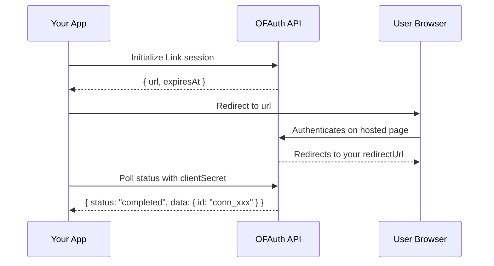

## Overview

Link is OFAuth's hosted authentication flow. You initialize a session, redirect the user to authenticate on OFAuth's secure page, then poll for the result. When authentication completes, you receive a **connection ID** that you use for all subsequent API calls.

<Info>
  The Link flow handles credentials, 2FA, and session management on OFAuth's side. Your application never touches OnlyFans passwords.
</Info>

## Complete Link Flow



## Initialize a Link Session

Create a Link session and redirect the user to the returned URL.

```python
from onlyfans_sdk import OFAuthClient, link

client = OFAuthClient(api_key="your-api-key")

try:
    session = link.init_v2_link(client, body={
        "redirectUrl": "https://yourapp.com/callback",
    })

    print("Redirect user to:", session["url"])
    print("Expires at:", session["expiresAt"])
except Exception as e:
    print("Failed to initialize Link:", e)
```

### Init Options

| Parameter | Type | Description |
| --- | --- | --- |
| `redirectUrl` | `string` | URL to redirect the user to after authentication |
| `clientReferenceId` | `string` | Your own reference ID to track this session |
| `connectionId` | `string` | Existing connection ID for re-authentication |

## Poll Link Status

After the user authenticates, poll the Link session to check if it completed. The response includes the status and, when completed, the connection data.

```python
status = link.get_v2_link(client, client_secret="cs_xxx")

print("Status:", status["status"])

if status["status"] == "completed" and "data" in status:
    print("Connection ID:", status["data"]["id"])
    print("Username:", status["data"]["userData"]["username"])
```

### Status Values

| Status | Meaning |
| --- | --- |
| `initialized` | Session created, user hasn't started yet |
| `pending` | User is in the authentication process |
| `awaiting_2fa` | Waiting for 2FA verification |
| `completed` | Authentication successful — connection ID available |
| `denied` | User denied access |
| `invalid_credentials` | Credentials were incorrect |
| `failed` | Authentication failed |
| `not_found` | Session not found or expired |

## Delete a Link Session

Cancel a Link session that is no longer needed:

```python
link.delete_v2_link(client, client_secret="cs_xxx")
```

## Complete Polling Example

In production, you'll typically poll the Link status in a loop until authentication completes or fails:

```python
import time
from onlyfans_sdk import OFAuthClient, OFAuthError, link

client = OFAuthClient(api_key="your-api-key")


def wait_for_authentication(client_secret: str) -> str:
    max_attempts = 60
    poll_interval = 3  # seconds

    for _ in range(max_attempts):
        status = link.get_v2_link(client, client_secret=client_secret)

        if status["status"] == "completed" and "data" in status:
            print("Authenticated:", status["data"]["userData"]["username"])
            return status["data"]["id"]  # Connection ID

        if status["status"] in ("initialized", "pending", "awaiting_2fa"):
            time.sleep(poll_interval)
            continue

        raise Exception(f"Authentication {status['status']}")

    raise Exception("Authentication timed out")


# Usage
try:
    session = link.init_v2_link(client, body={
        "redirectUrl": "https://yourapp.com/callback",
    })

    print("Send user to:", session["url"])

    # After user is redirected back, poll for completion
    connection_id = wait_for_authentication("cs_xxx")
    print("Connection ID:", connection_id)
except OFAuthError as e:
    print(f"API error {e.status}: {e}")
except Exception as e:
    print("Error:", e)
```

<Warning>
  **Use Sandbox for testing!** Before testing with real OnlyFans accounts, use the [Sandbox environment](/setup/sandbox) with test credentials. Too many login attempts on production accounts can trigger OnlyFans "suspicious activity" detection.
</Warning>

## Next Steps

<CardGroup cols={2}>
  <Card title="Connection Management" icon="link" href="/sdk/python/modules/authentication/link-connections">
    Manage, monitor, and import connections
  </Card>
  <Card title="Webhooks" icon="webhook" href="/reference/webhooks">
    Get notified when connections change status
  </Card>
</CardGroup>
