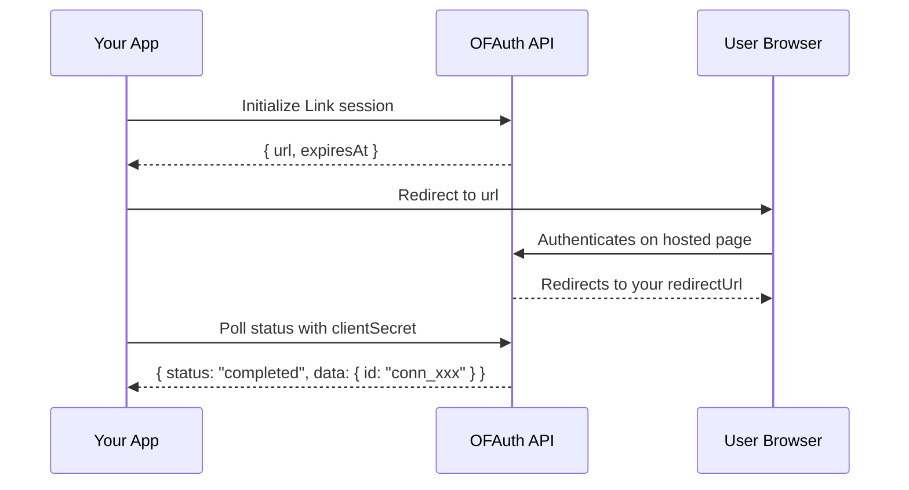

## Overview

Link is OFAuth's hosted authentication flow. You initialize a session, redirect the user to authenticate on OFAuth's secure page, then poll for the result. When authentication completes, you receive a **connection ID** that you use for all subsequent API calls.

<Info>
  The Link flow handles credentials, 2FA, and session management on OFAuth's side. Your application never touches OnlyFans passwords.
</Info>

## Complete Link Flow



## Initialize a Link Session

Create a Link session and redirect the user to the returned URL.

```typescript
import { createOFAuthClient } from '@ofauth/onlyfans-sdk';

const client = createOFAuthClient({ apiKey: 'your-api-key' });

try {
  const session = await client.link.init({
    body: {
      redirectUrl: 'https://yourapp.com/callback',
    },
  });

  console.log('Redirect user to:', session.url);
  console.log('Expires at:', session.expiresAt);
} catch (error) {
  console.error('Failed to initialize Link:', error);
}
```

### Init Options

| Parameter | Type | Description |
| --- | --- | --- |
| `redirectUrl` | `string` | URL to redirect the user to after authentication |
| `clientReferenceId` | `string` | Your own reference ID to track this session |
| `connectionId` | `string` | Existing connection ID for re-authentication |

## Poll Link Status

After the user authenticates, poll the Link session to check if it completed. The response includes the status and, when completed, the connection data.

```typescript
const status = await client.link.get({
  clientSecret: 'cs_xxx',
});

console.log('Status:', status.status);
// "initialized" | "pending" | "awaiting_2fa" | "completed" | "denied" | "failed"

if (status.status === 'completed' && status.data) {
  console.log('Connection ID:', status.data.id);
  console.log('Username:', status.data.userData.username);
}
```

### Status Values

| Status | Meaning |
| --- | --- |
| `initialized` | Session created, user hasn't started yet |
| `pending` | User is in the authentication process |
| `awaiting_2fa` | Waiting for 2FA verification |
| `completed` | Authentication successful — connection ID available |
| `denied` | User denied access |
| `invalid_credentials` | Credentials were incorrect |
| `failed` | Authentication failed |
| `not_found` | Session not found or expired |

## Delete a Link Session

Cancel a Link session that is no longer needed:

```typescript
await client.link.delete({ clientSecret: 'cs_xxx' });
```

## Complete Polling Example

In production, you'll typically poll the Link status in a loop until authentication completes or fails:

```typescript
import { createOFAuthClient, OFAuthAPIError } from '@ofauth/onlyfans-sdk';

const client = createOFAuthClient({ apiKey: 'your-api-key' });

async function waitForAuthentication(clientSecret: string): Promise<string> {
  const maxAttempts = 60;
  const pollInterval = 3000; // 3 seconds

  for (let i = 0; i < maxAttempts; i++) {
    const status = await client.link.get({ clientSecret });

    switch (status.status) {
      case 'completed':
        if (status.data && 'id' in status.data) {
          console.log('Authenticated:', status.data.userData.username);
          return status.data.id; // Connection ID
        }
        throw new Error('Completed but no connection data');

      case 'initialized':
      case 'pending':
      case 'awaiting_2fa':
        // Still in progress, keep polling
        await new Promise(r => setTimeout(r, pollInterval));
        break;

      case 'denied':
      case 'invalid_credentials':
      case 'failed':
      case 'not_found':
        throw new Error(`Authentication ${status.status}`);
    }
  }

  throw new Error('Authentication timed out');
}

// Usage
try {
  const session = await client.link.init({
    body: { redirectUrl: 'https://yourapp.com/callback' },
  });

  console.log('Send user to:', session.url);

  // After user is redirected back, poll for completion
  const connectionId = await waitForAuthentication('cs_xxx');
  console.log('Connection ID:', connectionId);
} catch (error) {
  if (error instanceof OFAuthAPIError) {
    console.error('API error:', error.status, error.message);
  } else {
    console.error('Error:', error);
  }
}
```

<Warning>
  **Use Sandbox for testing!** Before testing with real OnlyFans accounts, use the [Sandbox environment](/setup/sandbox) with test credentials. Too many login attempts on production accounts can trigger OnlyFans "suspicious activity" detection.
</Warning>

## Next Steps

<CardGroup cols={2}>
  <Card title="Connection Management" icon="link" href="/sdk/typescript/modules/authentication/link-connections">
    Manage, monitor, and import connections
  </Card>
  <Card title="Webhooks" icon="webhook" href="/reference/webhooks">
    Get notified when connections change status
  </Card>
</CardGroup>
